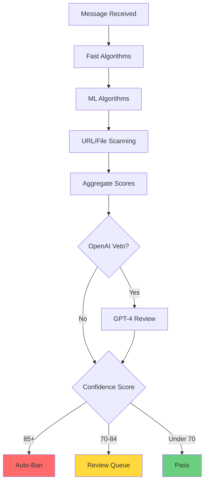

# Spam Detection Overview

TelegramGroupsAdmin uses a **multi-algorithm orchestration system** that runs up to 9 different spam detection checks in parallel on each message.

## How It Works

Each algorithm analyzes different aspects of the message and returns a confidence score (0-100). Individual scores are combined using **weighted averaging** to produce a final confidence score.

## The 9 Detection Algorithms

| Algorithm | Performance | Requirements |
|-----------|-------------|--------------|
| Stop Words | Fast (~45ms) | Configure stop words list |
| CAS (Combot Anti-Spam) | Fast (~12ms) | None (external API) |
| Similarity (TF-IDF) | Medium (~87ms) | Training samples needed |
| Naive Bayes | Fast | 50+ spam + 50+ ham samples |
| Spacing Detection | Fast | None |
| Invisible Characters | Fast | None |
| Translation | Medium | OpenAI API key |
| OpenAI Verification | Slow (~1.2s) | OpenAI API key |
| URL/File Scanning | Variable | ClamAV + VirusTotal |

## Decision Flow

## Performance

The default configuration (all 9 algorithms + OpenAI Veto) averages **255ms per message** with P95 at 821ms. This handles 500-5,000 messages/day easily.
