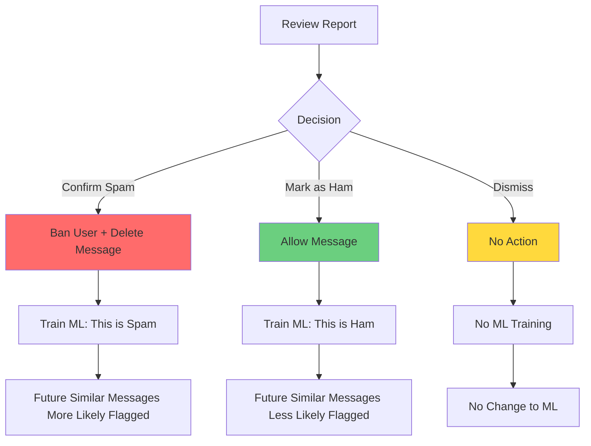

# Reports Queue - Moderation Central

The **Reports** page is your central hub for reviewing and managing spam detections that need human judgment. This is where borderline spam (confidence 70-84) and suspected impersonators land for your review.

**Think of it as**: Your moderation inbox - messages that aren't clearly spam or ham need your decision.

## Page Overview

The Reports page has two tabs:

1. **Moderation Reports** - Spam detections needing manual review
2. **Impersonation Alerts** - Suspected impersonators (duplicate photos, similar usernames)

Both tabs follow the same workflow: **Review → Decide → Act → Train**

[Screenshot: Reports page with both tabs]

---

## Moderation Reports Tab

This is where spam detections with confidence scores between **70-84** appear. These are "borderline" cases where the system isn't confident enough to auto-ban but suspicious enough to flag.

### What Triggers a Moderation Report?

A message lands in Moderation Reports if:
- **Confidence score is 70-84** (above review threshold but below auto-ban)
- **Training Mode is ON** (all detections go here regardless of score)
- **OpenAI veto overrode** an auto-ban (GPT-4 said "not spam")

### Report Card Layout

Each report displays:
- **Message preview** - First few lines of the message
- **User info** - Username, user ID, profile photo
- **Timestamp** - When message was sent
- **Confidence score** - Overall spam confidence (e.g., "78%")
- **Algorithm breakdown** - Which algorithms flagged it
- **Status** - Pending, Resolved, Dismissed
- **Action buttons** - Confirm Spam, Mark as Ham, Dismiss

[Screenshot: Moderation report card with all elements labeled]

---

## Understanding Confidence Scores

The confidence score (0-100) represents how certain the system is that a message is spam.

### Score Ranges

- **85-100**: High confidence spam → Auto-ban (if Training Mode OFF)
- **70-84**: Moderate confidence → Review Queue (manual review needed)
- **50-69**: Low confidence → Pass (allow message)
- **0-49**: Very low confidence → Definitely pass

### Why Borderline Cases Matter

**70-84 confidence** means:
- Multiple algorithms flagged it, but not all
- OR one algorithm strongly flagged it, others neutral
- OR patterns similar to spam but not definitive

**Your decision trains the ML algorithms!**
- Mark as spam → ML learns this pattern is spam
- Mark as ham → ML learns this pattern is legitimate

---

## Reviewing a Report - Step by Step

### Step 1: Read the Full Message

1. Click anywhere on the report card to expand details
2. Read the complete message text
3. Look for spam indicators:
   - Unsolicited promotions
   - Suspicious links
   - "Get rich quick" schemes
   - Aggressive calls to action
   - Off-topic content
   - Copy-paste spam

### Step 2: Check Algorithm Breakdown

Review which algorithms flagged the message:

**Strong indicators (likely spam)**:
- ✓ **CAS Database** (100%) - User in global spammer database
- ✓ **Stop Words** (90%+) - Multiple spam keywords matched
- ✓ **URL Content** (85%+) - Link to known malicious domain

**Moderate indicators (investigate further)**:
- ⚠️ **Naive Bayes** (70-80%) - ML thinks it's spam but not certain
- ⚠️ **Similarity** (70-80%) - Similar to known spam patterns
- ⚠️ **Spacing Detection** (60-80%) - Unusual character patterns

**Weak indicators (possibly false positive)**:
- ○ **Stop Words** (<60%) - Matched one common word
- ○ **Invisible Characters** (<50%) - Few suspicious characters
- ○ **Translation** (<60%) - Inconsistent across languages

### Step 3: Consider Context

Ask yourself:
- **Is this user established?** - Check their message history
- **Is this on-topic?** - Related to group's purpose?
- **Is it solicited?** - Was user asked for this info?
- **Is the tone spammy?** - Urgent, pushy, promotional?
- **Are there links?** - Do they go to legitimate sites?

### Step 4: Make a Decision

You have three options:

#### Option 1: Confirm Spam ✓

**Choose this if**: Message is definitely spam

**What happens**:
- User is permanently banned from the group
- Message is deleted from Telegram
- Added to spam training samples (trains ML)
- Report marked as "Resolved"
- Audit log entry created

**Example**: Unsolicited crypto signals promotion with suspicious links

#### Option 2: Mark as Ham ✗

**Choose this if**: Message is legitimate (false positive)

**What happens**:
- Message is allowed to stay
- User is NOT banned
- Added to ham training samples (trains ML)
- Report marked as "Resolved"
- Future similar messages less likely to be flagged

**Example**: Legitimate question about cryptocurrency that matched spam keywords

#### Option 3: Dismiss ⊘

**Choose this if**: You're unsure or need more information

**What happens**:
- No action taken
- User not banned, message stays
- Does NOT train ML (neutral)
- Report marked as "Dismissed"
- Can revisit later

**Example**: Borderline promotional content from regular member

[Screenshot: Report detail view with action buttons]

---

## Best Practices for Reviewing

### Daily Review Routine

**Morning routine (5-10 minutes)**:
1. Open Reports → Moderation Reports
2. Filter to "Pending" status
3. Review each report from top to bottom
4. Make decisions on all pending reports
5. Check "Resolved" tab to verify yesterday's actions

**Goal**: Empty the pending queue daily to prevent backlog.

### How to Decide Quickly

**Clear spam (instant decision)**:
- Multiple algorithms with high confidence (80%+)
- CAS Database flagged (known spammer)
- Blocked URL domains
- Obvious promotional content
- **Decision**: Confirm Spam

**Clear false positive (instant decision)**:
- Low confidence across all algorithms (70-75%)
- Only one weak algorithm flagged it
- Established user with good history
- On-topic, legitimate question
- **Decision**: Mark as Ham

**Borderline cases (investigate)**:
- Mixed algorithm signals
- New user with first message
- Promotional but on-topic
- Check user profile and message history
- **Decision**: Use judgment or Dismiss if unsure

### Patterns to Watch For

**Common spam patterns**:
- "Join my VIP group" - Recruitment spam
- "Guaranteed profits" - Scam promises
- "Click here now" - Urgency tactics
- "DM me" + link - Off-platform solicitation
- "Limited time offer" - Pressure tactics
- Copy-paste messages - Repeated content

**Common false positive patterns**:
- Legitimate crypto discussion with keywords
- Technical questions about trading
- News articles with clickbait titles
- Community event announcements
- Referral codes from known members

---

## Training Mode vs. Production Mode

### Training Mode (Learning Phase)

**When**: First 30-60 days, or after major configuration changes

**Behavior**:
- **ALL detections** → Moderation Reports (even 85%+ confidence)
- **No auto-bans** - You review everything
- **Goal**: Collect 100+ training samples

**Review workflow**:
1. Review every detection
2. Mark as spam or ham consistently
3. Build confidence in system accuracy
4. After 100+ reviews, transition to Production

### Production Mode (Active Moderation)

**When**: After training phase complete

**Behavior**:
- **85%+ confidence** → Auto-ban (no review)
- **70-84 confidence** → Moderation Reports (review)
- **<70 confidence** → Pass (allow)

**Review workflow**:
1. Review only borderline cases (70-84)
2. Occasional spot checks on auto-bans
3. Monitor for new spam patterns
4. Adjust thresholds as needed

[Screenshot: Training Mode toggle in Settings]

---

## Impersonation Alerts Tab

The second tab shows suspected impersonators - users who may be copying other members' profiles.

### What Triggers an Impersonation Alert?

An alert is created when:
- **Photo hash match** - User uploads same profile photo as existing member
- **Username similarity** - Username very similar to existing member (Levenshtein distance)
- **Combined signals** - New user with similar name AND photo

### Alert Display

Each alert shows:
- **Suspected impersonator** - New user's info
- **Original user** - Member being impersonated
- **Similarity score** - How similar (0-100%)
- **Evidence** - What triggered the alert (photo, username, both)
- **Risk level** - High, Medium, Low

### Reviewing Impersonation Alerts

**Step 1: Compare profiles**
- Look at both profile photos side-by-side
- Compare usernames character-by-character
- Check join dates (impersonator is newer)

**Step 2: Check message history**
- What has the suspected impersonator posted?
- Is it similar to original user's style?
- Are they soliciting DMs or money?

**Step 3: Decide**
- **Ban** - If it's a clear impersonation attempt
- **Dismiss** - If it's coincidental or legitimate (common photos, similar names)
- **Whitelist** - Add to impersonation whitelist (won't alert again)

### Common Impersonation Tactics

**Profile cloning**:
- Exact copy of profile photo
- Similar username (e.g., "@john_doe" → "@john_d0e" with zero)
- Similar display name

**Social engineering**:
- Impersonator DMs members pretending to be admin
- Requests funds, personal info, or external site visits
- Uses authority/trust of impersonated user

**Action**: Ban immediately if detected.

[Screenshot: Impersonation alert comparison view]

---

## Status Filters

Both tabs have status filters to organize reports:

### Pending

- **Definition**: Reports awaiting your decision
- **Default view**: This is what you see when opening Reports page
- **Action needed**: Review and resolve

### Resolved

- **Definition**: Reports you've acted on (Confirmed Spam or Marked as Ham)
- **Purpose**: Audit trail, verify past decisions
- **Action**: Read-only, can revert if needed

### Dismissed

- **Definition**: Reports you dismissed without action
- **Purpose**: Revisit later if more info available
- **Action**: Can reopen and resolve

### All

- **Definition**: Every report regardless of status
- **Purpose**: Search across all reports
- **Use case**: Find specific report by user or content

[Screenshot: Status filter dropdown]

---

## Advanced Features

### Bulk Actions (Future Feature)

Currently planned but not implemented:
- Select multiple reports
- Bulk confirm spam
- Bulk mark as ham
- Bulk dismiss

**Workaround**: Review reports one-by-one (keyboard shortcuts help)

### Search Reports

Filter reports by:
- **User** - Find all reports for specific user
- **Date range** - Reports from specific timeframe
- **Confidence range** - Only 80%+ confidence, for example
- **Chat** - Reports from specific Telegram group

**How to search**:
1. Use filter controls at top of page
2. Combine filters for precise results
3. Clear filters to reset

### Export Reports

Not currently available, planned for future:
- Export pending reports to CSV
- Export resolved reports for analysis
- Export impersonation alerts

**Workaround**: Use Analytics page for aggregate stats

---

## Integration with Messages Page

Reports and Messages pages are deeply integrated:

### From Reports → Messages

Click **View Message** on any report to:
- See message in full context (conversation thread)
- View user's entire message history
- Check if user has other flagged messages

### From Messages → Reports

Click **View Detection Report** on spam messages to:
- See the original report card
- Review your decision (if resolved)
- Re-evaluate if needed

**Cross-navigation** allows full context for every decision.

---

## Analytics and Metrics

Track your moderation performance in Analytics page:

### Metrics to Monitor

**Review Queue Stats**:
- **Pending count** - How many reports need review
- **Daily resolution rate** - How many you resolve per day
- **Average time to resolve** - How long reports sit pending

**Accuracy Metrics**:
- **False positive rate** - % of reports marked as ham
- **False negative rate** - Spam that slipped through (<70 confidence)
- **ML training samples** - Total spam/ham samples collected

**Action Stats**:
- **Bans per day** - How many users banned
- **Dismissals** - How often you're unsure
- **Reverted decisions** - Changes after initial decision

**Goal**: False positive rate <10%, pending queue cleared daily.

[Screenshot: Analytics showing review queue metrics]

---

## Troubleshooting

### Too many reports (overwhelmed)

**Solutions**:
- **Enable OpenAI Veto** - Reduces reports by 80-90% (GPT-4 filters borderline cases)
- **Raise review threshold** - Change from 70 to 75 (fewer reports)
- **Lower auto-ban threshold** - Change from 85 to 80 (more auto-bans, fewer reviews)
- **Disable sensitive algorithms** - Turn off Spacing Detection if too many false positives

### Too few reports (spam getting through)

**Solutions**:
- **Lower review threshold** - Change from 70 to 65 (catch more borderline spam)
- **Enable more algorithms** - Turn on Translation, Spacing Detection
- **Review auto-bans** - Check Messages page for 85%+ confidence spam to verify accuracy

### False positives in every batch

**Solutions**:
- **Review stop words list** - Remove overly broad keywords
- **Whitelist common domains** - Add legitimate sites to URL whitelist
- **Mark as ham consistently** - Train ML to recognize these patterns
- **Adjust algorithm weights** - Coming in future update

### Impersonation alerts are all false positives

**Solutions**:
- **Whitelist common photos** - Default avatars, group logos
- **Increase similarity threshold** - Require higher match % for alerts
- **Disable photo matching** - If group uses common imagery
- **Add legitimate name variations** - Whitelist similar usernames

---

## Common Workflows

### Morning Review Routine

**Time**: 5-10 minutes

1. **Open Reports** → Moderation Reports
2. **Check pending count** - Should be <20 from overnight
3. **Review from top to bottom**:
   - Quick decisions on obvious spam/ham
   - Dismiss borderline cases for later
4. **Switch to Impersonation Alerts**
5. **Check for new alerts**
6. **Verify yesterday's actions** in Resolved tab

### Weekly Audit

**Time**: 30 minutes

1. **Review last 7 days of resolved reports**:
   - Look for patterns in spam
   - Check if false positive rate increased
   - Identify new spam tactics
2. **Analyze impersonation attempts**:
   - Were they successful?
   - Did you catch them quickly?
3. **Adjust configuration**:
   - Add new stop words
   - Whitelist new domains
   - Update thresholds
4. **Review auto-bans in Messages page**:
   - Spot check 85%+ confidence bans
   - Unban any false positives

### Handling Backlog

**If you have 50+ pending reports**:

1. **Filter by confidence** - Start with 80%+ (likely spam)
2. **Bulk decisions** - Confirm obvious spam quickly
3. **Skip borderline** - Dismiss 70-75% confidence for now
4. **Set aside time** - 30 minutes focused review
5. **Enable OpenAI Veto** - Prevent future backlog

---

## Related Documentation

- **[Messages Tab](01-messages.md)** - View messages in context
- **[Spam Detection Guide](03-spam-detection.md)** - Understand algorithms
- **[First Configuration](../getting-started/02-first-configuration.md)** - Set up Training Mode
- **[Analytics](https://future-docs/analytics.md)** - Track moderation metrics

---

## Tips for Success

### Consistency is Key

- **Review daily** - Don't let pending queue grow
- **Be consistent** - Similar messages should get similar decisions
- **Trust the ML** - After 100+ samples, ML becomes reliable
- **Document patterns** - Keep notes on new spam tactics

### Use Your Judgment

- **Context matters** - A promotional message from a regular member may be okay
- **Group culture** - Some groups allow promotions, others don't
- **When in doubt, dismiss** - Better than wrong decision
- **Learn from mistakes** - If you unban someone, learn why they were flagged

### Optimize Your Workflow

- **Set a schedule** - Review at same time daily (habit formation)
- **Use keyboard shortcuts** - Faster than clicking
- **Filter aggressively** - Don't review everything at once
- **Enable OpenAI Veto** - Best investment for reducing workload

---

**Master spam detection next**: Continue to **[Spam Detection Guide](03-spam-detection.md)**!
