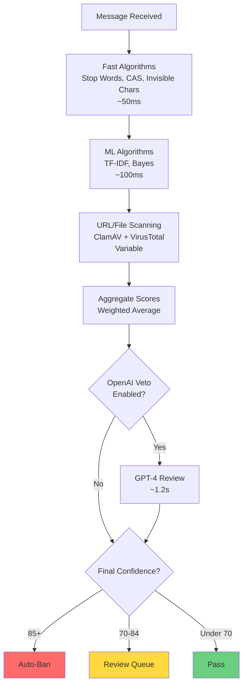
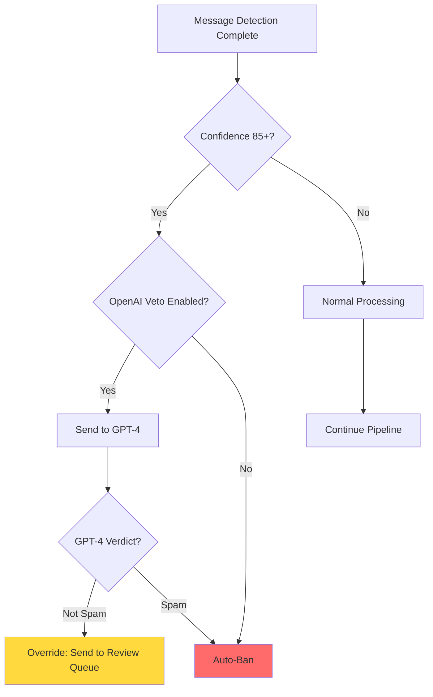
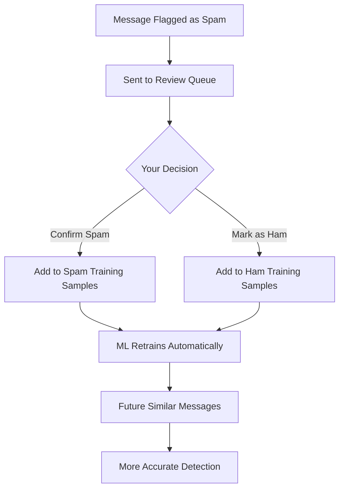

# Spam Detection - How It Works

TelegramGroupsAdmin uses a **multi-algorithm orchestration system** that runs up to 9 different spam detection checks in parallel on each message. This guide explains how the system works, what each algorithm does, and how to optimize detection accuracy.

## Detection Architecture

### Multi-Algorithm Approach

Instead of relying on a single detection method, TelegramGroupsAdmin runs **9 specialized algorithms simultaneously**, each analyzing different aspects of the message:

1. **Stop Words Detection** - Keyword matching
2. **CAS Database** - Global spammer lookup
3. **Similarity Detection (TF-IDF)** - Pattern comparison
4. **Naive Bayes Classifier** - Statistical spam detection
5. **Spacing Detection** - Character pattern analysis
6. **Invisible Character Detection** - Unicode abuse detection
7. **Translation** - Multi-language analysis
8. **OpenAI Verification** - AI-powered review
9. **URL/File Content** - Malicious link and malware detection

**Each algorithm** returns a confidence score (0-100). These scores are combined using **weighted averaging** to produce a final confidence score.

[Screenshot: Detection Algorithms configuration page]

---

## The Detection Pipeline

Here's what happens when a message arrives:



### Timing Performance

**Average detection time**: 255ms per message
- Fast algorithms: 45-50ms
- ML algorithms: 87-100ms
- URL/File scanning: Variable (depends on external APIs)
- OpenAI verification: ~1,200ms (only for borderline cases)

**P95 performance**: 821ms (99% of messages processed faster than this)

**Throughput**: Easily handles 5,000-20,000 messages/day on a single instance

---

## The 11 Detection Algorithms

### 1. Stop Words Detection

**What it does**: Matches message text against a customizable keyword blocklist

**How it works**:
- Compares message against your stop words list
- Case-insensitive matching
- Partial word matching (optional)
- Supports phrases ("crypto signals", "guaranteed profits")

**Configuration**:
- Enable/disable in Detection Algorithms page
- Manage stop words: Settings → Training Data → Stop Words Library
- Add common spam phrases

**Strengths**:
- ✓ Extremely fast (~5ms)
- ✓ No false positives if keywords are well-chosen
- ✓ Easy to understand and customize
- ✓ No training required

**Weaknesses**:
- ✗ Requires manual keyword maintenance
- ✗ Can't detect novel spam patterns
- ✗ May catch legitimate messages with spam keywords

**Best for**: Groups with predictable spam patterns (crypto scams, referral spam)

**Example detection**:
```
Message: "Join my VIP crypto signals group! Guaranteed 500% profits!"
Matched keywords: "VIP signals", "guaranteed profits"
Confidence: 100%
```

[Screenshot: Stop Words Library management]

---

### 2. CAS (Combot Anti-Spam) Database

**What it does**: Looks up user ID in a global database of known spammers maintained by Combot

**How it works**:
- Sends user ID to CAS API
- Receives yes/no response: Is this user a known spammer?
- If yes, returns 100% confidence
- If no, returns 0% confidence

**Configuration**:
- Enable/disable in Detection Algorithms page
- No additional configuration needed (uses public API)

**Strengths**:
- ✓ Very fast (~12ms)
- ✓ Catches known spammers across Telegram
- ✓ Zero false positives (database curated)
- ✓ No training required

**Weaknesses**:
- ✗ Only catches previously reported spammers
- ✗ New spammer accounts not in database
- ✗ Requires internet connection to CAS API

**Best for**: All groups (recommended to enable always)

**Example detection**:
```
User ID: 123456789
CAS Database: FOUND
Reason: "Reported for spam in 47 groups"
Confidence: 100%
```

---

### 3. Similarity Detection (TF-IDF)

**What it does**: Compares new messages to known spam patterns using TF-IDF (Term Frequency-Inverse Document Frequency) analysis

**How it works**:
- Converts messages to TF-IDF vectors (mathematical representations)
- Compares new message vector to spam training samples
- Calculates cosine similarity (0-1)
- Returns similarity as confidence percentage

**Configuration**:
- Enable/disable in Detection Algorithms page
- Set similarity threshold (default: 0.75)
- **Requires**: 100+ spam training samples

**Strengths**:
- ✓ Catches spam similar to previous examples
- ✓ Learns automatically from your feedback
- ✓ Good at detecting spam pattern variations
- ✓ Language-agnostic (works in any language)

**Weaknesses**:
- ✗ Requires training data (100+ samples)
- ✗ Slower than simple keyword matching (~87ms)
- ✗ Can't detect completely novel spam types

**Best for**: Groups with recurring spam patterns (pump-and-dump, phishing)

**Example detection**:
```
Message: "Exclusive crypto tips! Join telegram.me/scamgroup"
Similar to 12 known spam samples
Average similarity: 0.82
Confidence: 82%
```

[Screenshot: Similarity detection in action with sample comparison]

---

### 4. Naive Bayes Classifier

**What it does**: Statistical machine learning algorithm that classifies messages as spam or ham based on probability

**How it works**:
- Learns word probabilities from training samples
- Calculates P(spam | words in message)
- Uses Bayes' theorem for classification
- Returns probability as confidence percentage

**Configuration**:
- Enable/disable in Detection Algorithms page
- Set probability threshold (default: 0.75)
- **Requires**: 50+ spam samples AND 50+ ham samples

**Strengths**:
- ✓ Learns from both spam AND legitimate messages
- ✓ Fast training and prediction
- ✓ Works well with limited data (50+ samples)
- ✓ Handles novel spam patterns

**Weaknesses**:
- ✗ Requires balanced training data (spam + ham)
- ✗ Can overfit to training samples if too few
- ✗ Less accurate than modern deep learning (but faster)

**Best for**: All groups after training phase complete

**Example detection**:
```
Message: "Click here for free money!"
Word probabilities:
  "click" → 78% spam, 22% ham
  "free" → 91% spam, 9% ham
  "money" → 82% spam, 18% ham
Final probability: 0.84
Confidence: 84%
```

---

### 5. Spacing Detection

**What it does**: Detects unusual character spacing and patterns that spammers use to evade keyword filters

**How it works**:
- Analyzes character distribution
- Detects excessive spaces between letters
- Identifies alternating case patterns
- Checks for unusual punctuation density

**Configuration**:
- Enable/disable in Detection Algorithms page
- No training required
- No threshold configuration

**Strengths**:
- ✓ Fast execution
- ✓ Catches obfuscation attempts
- ✓ No training required
- ✓ Complements keyword detection

**Weaknesses**:
- ✗ Can flag artistic text formatting
- ✗ Some legitimate messages use spacing for emphasis
- ✗ Less reliable than other algorithms

**Best for**: Groups with persistent spammers who modify messages to evade detection

**Example detection**:
```
Message: "C L I C K   H E R E   F O R   P R O F I T S"
Spacing ratio: 3.2 (3x normal)
Unusual pattern detected
Confidence: 75%
```

---

### 6. Invisible Character Detection

**What it does**: Detects Unicode abuse including zero-width spaces, invisible characters, and homoglyphs

**How it works**:
- Scans for zero-width characters (U+200B, U+200C, U+200D, etc.)
- Detects invisible separators
- Identifies homoglyphs (look-alike characters from different alphabets)
- Counts suspicious character ratio

**Configuration**:
- Enable/disable in Detection Algorithms page
- No training required
- Automatic threshold detection

**Strengths**:
- ✓ Very fast
- ✓ Nearly zero false positives
- ✓ Catches sophisticated obfuscation
- ✓ No training required

**Weaknesses**:
- ✗ Only catches this specific technique
- ✗ Spammers may use other obfuscation methods

**Best for**: All groups (recommended to enable always)

**Example detection**:
```
Message: "He​llo! Cl​ick he​re"
         (contains zero-width spaces: ​)
Invisible characters found: 3
Suspicious character ratio: 5%
Confidence: 90%
```

---

### 7. SEO/Scraping Spam Detection

**What it does**: Detects SEO spam, web scraping bots, and automated content promotion patterns

**How it works**:
- Identifies SEO keyword stuffing patterns (excessive keywords, unnatural repetition)
- Detects scraper signatures (automated posting patterns, templated content)
- Checks for promotional link patterns (affiliate links, referral codes)
- Analyzes message structure for bot-like formatting

**Configuration**:
- Enable/disable in Detection Algorithms page
- No additional configuration required
- Works automatically on all text messages

**Strengths**:
- ✓ Fast, pattern-based detection
- ✓ Catches automated promotional content
- ✓ No API keys or external services needed
- ✓ Low false positive rate

**Weaknesses**:
- ✗ May miss sophisticated scraping bots
- ✗ Requires pattern updates as spam evolves
- ✗ Can flag legitimate content with multiple links

**Best for**: Groups targeted by SEO spammers, affiliate marketers, content scrapers

**Example detection**:
```
Message: "Best deals on crypto! Buy now! Crypto trading crypto signals crypto profit! Click here: bit.ly/ref123"
Analysis:
  Keyword repetition: "crypto" appears 4 times in 15 words
  Promotional link: Referral code detected in URL
  SEO pattern: Excessive call-to-action phrases
Confidence: 88%
```

---

### 9. Translation (Multi-Language Detection)

**What it does**: Translates non-English messages and analyzes translation consistency across multiple attempts

**How it works**:
- Detects non-Latin scripts (Cyrillic, Chinese, Arabic, etc.)
- Translates to English using OpenAI
- Runs spam detection on translated text
- Compares multiple translation attempts for consistency

**Configuration**:
- Enable/disable in Detection Algorithms page
- **Requires**: OpenAI API key
- Automatic for messages <80% Latin script

**Strengths**:
- ✓ Works with any language
- ✓ Catches international spam
- ✓ Uses other algorithms on translated text
- ✓ Detects translation inconsistencies (common in spam)

**Weaknesses**:
- ✗ Requires OpenAI API key ($$$)
- ✗ Slower than other methods (~500ms)
- ✗ Translation costs add up

**Best for**: International groups with non-English spam

**Example detection**:
```
Original (Russian): "Бесплатные деньги здесь!"
Translation: "Free money here!"
Stop Words match: "free money"
Confidence: 85%
```

[Screenshot: Translation in action with original and translated text]

---

### 10. OpenAI Verification (GPT-4 Spam Detection)

**What it does**: Uses GPT-4 to analyze messages with human-like understanding of context, tone, and intent

**How it works**:
- Sends message + context to GPT-4
- Custom prompt describes your group's rules and spam patterns
- GPT-4 returns spam/ham verdict with reasoning
- Confidence based on GPT-4's certainty

**Configuration**:
- Enable/disable in Detection Algorithms page
- **Requires**: OpenAI API key
- Configure custom prompt: Settings → Content Detection → External Services → OpenAI Integration
- Set threshold (default: 75)

**Strengths**:
- ✓ Best accuracy of all algorithms
- ✓ Understands context and nuance
- ✓ Customizable via prompt engineering
- ✓ Learns from your group's culture

**Weaknesses**:
- ✗ Slowest algorithm (~1,200ms)
- ✗ Most expensive ($0.002 per message)
- ✗ Requires OpenAI API key
- ✗ External dependency

**Best for**: High-value groups where accuracy is critical

**Example detection**:
```
Message: "Check out this new project: [link]"
GPT-4 Analysis:
  "This appears to be unsolicited promotion of an external project.
   The message lacks context and is from a new user. The link goes
   to a domain not associated with the group's topic. Likely spam."
Verdict: SPAM
Confidence: 92%
```

---

### 8. URL/File Content Detection

**What it does**: Scans URLs against 540,000+ malicious domain blocklists and files for malware

**How it works**:
- **URLs**: Extracts all links from message
  - Checks against Block List Project categories (phishing, scam, malware, etc.)
  - Checks against custom blocklists
  - Checks whitelist for exceptions
- **Files**: Scans uploaded files
  - ClamAV antivirus scanning
  - VirusTotal multi-engine scanning (optional)
  - Hash-based malware detection

**Configuration**:
- Enable/disable in Detection Algorithms page
- Configure URL filters: Settings → Content Detection → URL Filtering
- Configure file scanning: Settings → Content Detection → File Scanning
- **Requires**: ClamAV running, VirusTotal API key (optional)

**Strengths**:
- ✓ Huge blocklist database (540K+ domains)
- ✓ Multi-engine malware detection
- ✓ Nearly zero false positives on malware
- ✓ Catches phishing and scams

**Weaknesses**:
- ✗ Requires external services (ClamAV, VirusTotal)
- ✗ Variable performance (depends on API response times)
- ✗ New malicious domains may not be in database yet

**Best for**: All groups (recommended to enable always)

**Example detection**:
```
Message: "Great opportunity: http://phishing-site.com/login"
URL Analysis:
  Domain: phishing-site.com
  Blocklist: Block List Project - Phishing
  Category: Financial Phishing
  First seen: 2 days ago
Confidence: 100%
```

[Screenshot: URL Filtering configuration with blocklist categories]

---

### 10. Image Spam Detection

**What it does**: Analyzes images in messages using 3-layer detection strategy to catch image-based spam

**How it works**:
- **Layer 1**: Perceptual hash similarity matching against known spam images (fastest, most reliable)
- **Layer 2**: OCR text extraction + spam checks on extracted text (catches text-heavy image spam)
- **Layer 3**: OpenAI Vision API fallback for comprehensive analysis (slow but accurate)

**Configuration**:
- Enable/disable in Detection Algorithms page
- Requires OpenAI API key for Vision API (Layer 3)
- Automatically trains on confirmed spam/ham images

**Strengths**:
- ✓ Catches spam images quickly via hash matching
- ✓ OCR detects text-based image spam (screenshots of spam messages)
- ✓ Vision API provides context-aware analysis
- ✓ Self-learning (hash database grows with training)

**Weaknesses**:
- ✗ Layer 3 (Vision API) is expensive (~$0.01 per image)
- ✗ Minor image edits can bypass hash matching
- ✗ OCR may fail on stylized text

**Best for**: Groups where spammers post image-based content (common in crypto/trading groups)

**Example detection**:
```
Message: [Image: Screenshot of "Join my signals group" text]
Analysis:
  Layer 1: No hash match
  Layer 2 (OCR): Extracted text: "Join my VIP signals group! 100% profit!"
    → Stop Words match: "signals", "profit"
    → Confidence: 85%
  Layer 3: Skipped (Layer 2 sufficient)
Final Confidence: 85%
```

---

### 11. Video Spam Detection

**What it does**: Analyzes video content in messages for spam indicators

**How it works**:
- Extracts frames from video at intervals
- Runs image spam detection on extracted frames
- Checks video metadata (duration, file size) for spam patterns

**Configuration**:
- Enable/disable in Detection Algorithms page
- Uses same configuration as Image Spam Detection
- Automatically limits processing to first 10 frames for performance

**Strengths**:
- ✓ Catches video-based spam campaigns
- ✓ Reuses image detection infrastructure (efficient)
- ✓ Metadata checks catch suspicious patterns (very short/long videos)

**Weaknesses**:
- ✗ Processing time depends on video length
- ✗ May miss spam in middle/end of video (only samples frames)
- ✗ Expensive if using Vision API on many frames

**Best for**: Groups where video spam is common (promotional content, scams)

**Example detection**:
```
Message: [Video: 30-second promotional video]
Analysis:
  Frames extracted: 5 (at 0s, 7s, 15s, 22s, 30s)
  Frame 1: OCR detected "Limited time offer"
    → Stop Words match: 80% confidence
  Frame 3: Similar to known spam video (hash match)
    → Confidence: 95%
Final Confidence: 95%
```

---

## OpenAI Veto System

The **OpenAI Veto** is a special feature that acts as a final check for borderline cases.

### How Veto Works



### When Veto Triggers

Veto only activates when:
- **Confidence ≥ Veto Threshold** (default: 85)
- **OpenAI Veto is enabled**
- **OpenAI API key is configured**

**Cost**: Only runs on messages that would be auto-banned (~$0.002 per message)

### Veto Impact

**Effectiveness**: Reduces false positives by **80-90%**

**Example**:
```
Initial detection: 88% confidence (would auto-ban)
↓
OpenAI Veto analyzes context
↓
GPT-4 verdict: "This is a legitimate technical discussion about crypto trading.
                Keywords triggered false positive."
↓
Override: Send to Review Queue instead of auto-ban
```

**Best practice**: Enable veto after initial training period to dramatically improve accuracy.

[Screenshot: OpenAI Veto configuration]

---

## Confidence Score Aggregation

How individual algorithm scores combine into the final confidence:

### Weighted Averaging

Each algorithm has a **weight** (importance factor):

```
Final Confidence = (
  StopWords × 1.2 +
  CAS × 1.5 +
  Similarity × 1.0 +
  Bayes × 1.1 +
  Spacing × 0.8 +
  InvisibleChars × 1.0 +
  Translation × 1.0 +
  OpenAI × 1.3 +
  URLFile × 1.4
) / Total Weights
```

**Higher weights** = More trust in that algorithm

**CAS and URLFile have highest weights** because they're nearly always accurate.

### Example Calculation

```
Message: "Join my VIP crypto signals! bit.ly/scam123"

Algorithm Scores:
  Stop Words: 100% × 1.2 = 120
  CAS: 0% × 1.5 = 0
  Similarity: 85% × 1.0 = 85
  Bayes: 78% × 1.1 = 85.8
  Spacing: 60% × 0.8 = 48
  Invisible Chars: 0% × 1.0 = 0
  Translation: N/A (English)
  OpenAI: 92% × 1.3 = 119.6
  URL/File: 100% × 1.4 = 140

Total: 598.4
Total Weights: 9.3
Final Confidence: 598.4 / 9.3 = 64.3%

Action: PASS (below 70 threshold)
```

**Note**: This is a simplified example. Actual weights are configurable and may differ.

---

## Training the ML Algorithms

Machine learning algorithms (Similarity, Bayes) improve over time as you provide feedback.

### Training Workflow



### Training Requirements

**Similarity Detection (TF-IDF)**:
- Minimum: 100 spam samples
- Recommended: 200+ spam samples
- Ham samples: Optional but helpful

**Naive Bayes**:
- Minimum: 50 spam + 50 ham samples
- Recommended: 100+ of each
- **Must be balanced**: Equal spam and ham samples

### Collecting Training Data

**Phase 1: Training Mode (Days 1-30)**:
1. Enable Training Mode
2. Review all detections
3. Mark as spam or ham consistently
4. Goal: 100+ spam, 100+ ham samples

**Phase 2: Production with Feedback (Days 31+)**:
1. Disable Training Mode
2. Auto-bans happen, borderline go to review
3. Continue marking borderline cases
4. ML continues learning from your feedback

### Training Tips

**Quality over quantity**:
- Mark samples consistently
- Don't mark if unsure (use Dismiss)
- Review samples should represent real spam

**Balance your dataset**:
- If you have 200 spam samples, collect 200 ham samples too
- Imbalanced data skews ML predictions

**Review training data**:
- Settings → Training Data → Training Samples
- Delete bad samples if needed
- Ensure samples are correctly labeled

[Screenshot: Training Samples management page]

---

## Optimizing Detection Accuracy

### Common Issues and Solutions

**Too many false positives (legitimate messages flagged)**:

**Solutions**:
1. **Enable OpenAI Veto** - Reduces false positives by 80-90%
2. **Increase auto-ban threshold** - 85 → 90 or 95
3. **Whitelist common domains** - Settings → URL Filtering → Whitelist
4. **Review stop words** - Remove overly broad keywords
5. **Mark as ham consistently** - Train ML to recognize legitimate patterns

**Spam getting through (false negatives)**:

**Solutions**:
1. **Lower auto-ban threshold** - 85 → 80
2. **Enable more algorithms** - Spacing, Translation, OpenAI
3. **Add stop words** - Keywords from spam that slipped through
4. **Block domains manually** - Settings → URL Filtering → Manual Domains
5. **Enable stricter URL blocklists** - Ads, Tracking categories

**Inconsistent detection (same spam sometimes caught, sometimes not)**:

**Solutions**:
1. **Collect more training data** - ML needs 100+ samples
2. **Enable multiple algorithms** - Don't rely on just one
3. **Use consistent thresholds** - Don't change settings frequently
4. **Check algorithm weights** - Ensure reliable algorithms have higher weights

---

## Performance and Scaling

### Current Performance

**Average detection time**: 255ms per message
**P95 (95th percentile)**: 821ms
**P99 (99th percentile)**: ~2 seconds (includes OpenAI calls)

**Throughput**: 5,000-20,000 messages/day comfortably

### Optimization Tips

**If detection is slow** (>500ms average):

1. **Disable slow algorithms temporarily**:
   - Translation (500ms)
   - OpenAI Verification (1,200ms)

2. **Use OpenAI Veto instead** of always-on OpenAI Verification
   - Veto only runs on borderline cases
   - 10x fewer API calls

3. **Limit URL blocklists**:
   - Enable only essential categories (Phishing, Scam, Malware)
   - Disable Ads/Tracking blocklists

4. **Increase min message length**:
   - Skip detection for very short messages (<10 chars)
   - Most spam is longer

**If using too many OpenAI API calls**:

1. **Use Veto mode only** (not verification on every message)
2. **Increase veto threshold** (85 → 90)
3. **Disable Translation** for English-only groups
4. **Set OpenAI rate limits** in configuration

---

## Related Documentation

- **[First Configuration](../getting-started/02-first-configuration.md)** - Initial setup
- **[Reports Queue](02-reports.md)** - Review and train
- **[URL Filtering](04-url-filtering.md)** - Configure blocklists
- **[Content Tester](05-content-tester.md)** - Test detection
- **[AI Prompt Builder](06-ai-prompt-builder.md)** - Customize OpenAI prompts

---

**Next: Master URL filtering** → Continue to **[URL Filtering Guide](04-url-filtering.md)**!
