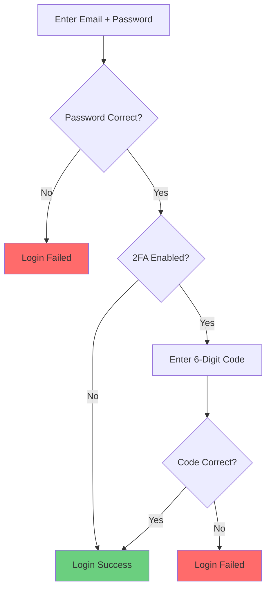

# Profile & Security - Your Account Settings

The Profile page allows you to manage your personal account settings, security features, Telegram account linking, and notification preferences.

**Access**: Profile (click your name in sidebar, or navigate to `/profile`)

## Page Sections

The Profile page is organized into sections:

1. **Account Information** - Email, username
2. **Password Management** - Change password
3. **Two-Factor Authentication** - Enable/disable 2FA
4. **Telegram Account Linking** - Link your Telegram account(s)
5. **Notification Preferences** - DM notification settings

[Screenshot: Profile page full view]

---

## Account Information

### Email Address

**Your registered email**:
- Used for login
- Receives system notifications
- Cannot be changed (currently)

**Future feature**: Email change with verification

### Username Display

**Your display name** in the system:
- Shown in audit logs
- Appears in "Created by" fields
- Defaults to email username

**Future feature**: Customizable display name

---

## Password Management

### Changing Your Password

**To change password**:

1. Navigate to **Profile** page
2. Find **Password Management** section
3. Click **Change Password** button
4. Enter current password
5. Enter new password (twice for confirmation)
6. Click **Save New Password**

**Tips for strong passwords**:
- Use 12+ characters
- Use passphrase: "correct-horse-battery-staple"
- Use password manager to generate
- Don't reuse passwords from other sites
- Change password every 90 days (recommended)

[Screenshot: Change password dialog]

### Password Security

**System protection**:
- Account lockout after failed login attempts

**If you forget your password**:
1. Click **Forgot Password** on login page
2. Enter your email
3. Receive password reset link
4. Link valid for 24 hours
5. Click link and set new password

---

## Two-Factor Authentication (2FA)

2FA adds a second layer of security beyond just your password. **Strongly recommended for all users**, especially Owners and GlobalAdmins.

### How 2FA Works

### Setting Up 2FA

**First-time setup**:

1. Navigate to **Profile** → **Two-Factor Authentication** section
2. Click **Enable 2FA** button
3. **Scan QR code** with your authenticator app:
   - Google Authenticator
   - Microsoft Authenticator
   - Authy
   - 1Password
   - Bitwarden
4. Enter the 6-digit code from your app to verify
5. Click **Confirm and Enable**

**After enabling**:
- You'll be shown **backup codes** (one-time use codes)
- **Save these somewhere safe** (password manager, encrypted file)
- You'll need them if you lose access to your authenticator app
- You won't see them again!

[Screenshot: 2FA setup with QR code]

### Backup Codes

**Backup codes** are one-time recovery codes in case you lose your authenticator:

**Each code**:
- Can be used once
- 8 characters long
- Valid until used
- You get 10 codes initially

**How to use**:
1. Login with email + password
2. When prompted for 2FA code, click **Use Backup Code**
3. Enter one of your backup codes
4. Code is consumed, cannot be reused

**Regenerate codes**:
- Profile → Two-Factor Authentication → **Regenerate Backup Codes**
- Old codes invalidated
- 10 new codes generated

### Disabling 2FA

**To disable** (not recommended):

1. Profile → Two-Factor Authentication
2. Click **Disable 2FA**
3. Enter current 2FA code to confirm
4. Click **Confirm Disable**

**Warning**: Disabling 2FA makes your account less secure.

---

## Telegram Account Linking

Link your Telegram account to receive direct message notifications from the bot.

### Why Link Your Telegram Account?

**Benefits**:
- Receive DM notifications when you're mentioned
- Get alerts for critical spam detections
- Verify your identity as an admin
- Required for some future features

**Without linking**:
- You can still use the web interface
- You won't receive DM notifications
- Some features may be limited

### How to Link

**Step-by-step**:

1. Navigate to **Profile** → **Telegram Account Linking**
2. Click **Generate Link Token** button
3. A 6-character code appears (e.g., `ABC123`)
4. Code valid for **15 minutes**
5. Open Telegram on your phone/computer
6. Find your TelegramGroupsAdmin bot (search by username)
7. Start a chat with the bot (click **Start** if first time)
8. Send this command: `/link ABC123` (replace with your actual code)
9. Bot replies: "Account linked successfully!"
10. Refresh Profile page to see linked account

[Screenshot: Link token generated with instructions]

### Multiple Telegram Accounts

You can link **multiple Telegram accounts** to one web account:

**Why**:
- Personal and work Telegram accounts
- Multiple phone numbers
- Different devices

**How**:
- Generate link token
- Send `/link` command from different Telegram account
- Both accounts linked

**Viewing linked accounts**:
- Profile page shows all linked Telegram accounts
- Username and user ID displayed

### Unlinking Accounts

**To unlink a Telegram account**:

1. Profile → Telegram Account Linking
2. Find the account in the list
3. Click **Unlink** button
4. Confirm action

**Effect**:
- That Telegram account stops receiving DM notifications
- Can re-link anytime

### Troubleshooting Linking

**Token expired**:
- Tokens expire after 15 minutes
- Generate a new token and try again

**Bot doesn't respond**:
- Make sure you're messaging the correct bot
- Check bot username
- Verify bot is running (check Dashboard health)

**"User not found" error**:
- You must start a chat with the bot first
- Click **Start** button in Telegram before sending `/link`

---

## Notification Preferences

Configure what notifications you receive via Telegram DM.

### Notification Types

**Spam Detection Alerts**:
- Notified when high-confidence spam is detected
- Includes message preview and confidence score
- Can be noisy in active groups

**Moderation Reports**:
- Notified when new reports enter review queue
- Summary of pending reports
- Daily digest option

**System Alerts**:
- Bot disconnected
- Health check failures
- Configuration changes by other admins

**Mention Notifications**:
- When you're mentioned in audit log
- When another admin responds to your report review

[Screenshot: Notification preferences checkboxes]

### Configuring Preferences

**To configure**:

1. Profile → Notification Preferences
2. Check/uncheck notification types
3. Set frequency:
   - Instant (realtime)
   - Hourly digest
   - Daily digest
4. Set quiet hours (optional)
   - Don't notify between 10 PM - 8 AM
5. Click **Save Preferences**

**Recommendation**:
- Enable: System Alerts, Mention Notifications
- Disable: Spam Detection Alerts (unless small group)
- Use Daily Digest for Moderation Reports

---

## Account Security Settings

### Session Management (Future Feature)

View and manage active sessions:
- See all devices you're logged in from
- Last activity timestamp for each session
- Revoke sessions remotely

**Currently**: No session management UI, logout revokes current session only

### Login History (Future Feature)

View recent login attempts:
- Successful logins with IP and timestamp
- Failed login attempts
- Suspicious activity alerts

### Account Lockout

**Automatic lockout** after failed login attempts:
- 5 failed attempts → 15-minute lockout
- 10 failed attempts → 1-hour lockout
- 15 failed attempts → 24-hour lockout

**To unlock**:
- Wait for lockout period to expire
- Or use password reset link (sent via email)

**Admin can unlock**:
- Owner can unlock other users
- Settings → System → Admin Accounts → Unlock

---

## Privacy and Data

### What Data is Stored

**Your account includes**:
- Email address (for login)
- Password (hashed with bcrypt)
- 2FA secret (encrypted)
- Telegram user ID (if linked)
- Last login timestamp
- Login history (IP addresses)

**NOT stored**:
- Your Telegram password
- Your Telegram messages (only cached for moderation)
- Your personal Telegram data

### Data Retention

**Account data**:
- Kept until account deleted
- Audit log entries preserved after deletion (marked as "Deleted User")

**Message data**:
- Retained per retention policy (default: 30 days)
- Spam/ham training samples kept indefinitely

### Deleting Your Account

**To delete**:
- Contact system Owner
- Owner can delete via Settings → Admin Accounts → Delete
- Cannot self-delete (security measure)

**Effect**:
- Account permanently deleted
- Cannot be undone
- Audit log entries preserved
- Must re-register if you want to return

---

## Best Practices

### Security Checklist

✓ **Use strong, unique password** (12+ characters, password manager)
✓ **Enable 2FA immediately** (required for Owners)
✓ **Save backup codes** in secure location
✓ **Link Telegram account** for notifications
✓ **Review notification preferences** to avoid spam
✓ **Check Profile quarterly** to verify settings

### Regular Maintenance

**Monthly**:
- Review linked Telegram accounts (unlink old ones)
- Check notification settings (adjust if too noisy)

**Quarterly**:
- Change password
- Regenerate 2FA backup codes
- Review login history (future feature)

**Immediately if**:
- You suspect account compromise
- You lose access to authenticator app (use backup codes!)
- You change phone number (relink Telegram)

---

## Troubleshooting

### Can't login after enabling 2FA

**Symptoms**:
- 2FA code not working
- Authenticator app lost

**Solutions**:
1. **Use backup code**:
   - Click "Use Backup Code" on login
   - Enter one of your saved backup codes
2. **Disable 2FA** (if no backup codes):
   - Contact system Owner
   - Owner can disable 2FA for your account
3. **Set up 2FA again**:
   - Re-scan QR code with new device

### Telegram linking not working

**Symptoms**:
- `/link` command does nothing
- Bot doesn't respond

**Solutions**:
1. **Start chat with bot first**:
   - Click **Start** button in Telegram
   - Then send `/link` command
2. **Check token expiration**:
   - Generate new token if >15 minutes old
3. **Verify bot username**:
   - Make sure you're messaging the correct bot

### Not receiving notifications

**Symptoms**:
- Telegram account linked but no notifications

**Solutions**:
1. **Check notification preferences**:
   - Profile → Notification Preferences
   - Verify types are enabled
2. **Test notification**:
   - Trigger a test notification (future feature)
3. **Check Telegram DM**:
   - Open chat with bot
   - Look for older notifications (may be backlogged)
4. **Relink account**:
   - Unlink and relink Telegram account

---

## Related Documentation

- **[Quick Start Guide](../getting-started/01-quick-start.md)** - Initial account setup
- **[Web User Management](../admin/01-web-user-management.md)** - Managing other users
- **[Security Settings](https://future-docs/security-settings.md)** - System-wide security

---

**Congratulations!** You've completed the TelegramGroupsAdmin documentation. You're now ready to effectively manage spam detection and moderation in your Telegram groups!

**Need more help?**
- Browse **Documentation** in the sidebar
- Check **Help** articles for quick reference
- Review **Audit Log** to understand system actions
