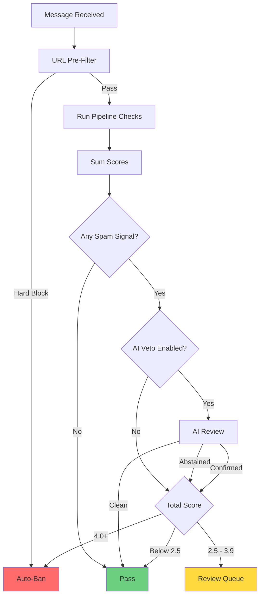

# Spam Detection Overview

TelegramGroupsAdmin uses a **multi-algorithm content detection system** that runs up to 14 checks against each message. The system uses **additive scoring** — each check contributes 0.0 to 5.0 points, and the total determines the action taken.

## How Additive Scoring Works

Each detection check independently analyzes one aspect of a message and returns a score:

- **0.0 points (abstained)** — the check found no evidence of spam (e.g., no URLs to scan, classifier not trained). Abstentions do not affect the total.
- **0.1–5.0 points** — positive spam signal. Higher scores indicate stronger evidence.

Scores from all checks are **summed** to produce a total. The total is compared against configurable thresholds to decide the action.

### Default Thresholds

| Total Score | Action |
|-------------|--------|
| 4.0+ points | Auto-Ban |
| 2.5–3.9 points | Review Queue |
| Below 2.5 points | Pass (allowed) |

Both thresholds are configurable per chat in **Settings > Content Detection**.

## The 14 Detection Checks

| Check | What It Does | Speed | Requirements |
|-------|-------------|-------|--------------|
| **StopWords** | Matches message text against a database-managed list of known spam phrases. Scores 0.5–2.0 based on match count and severity. | Fast | Configure stop words list |
| **CAS** | Checks users against the Combot Anti-Spam database of known spammers. Runs at **user join**, not per-message. | Fast | None (external API) |
| **Similarity** | ML.NET SDCA classifier trained on your group's spam/ham samples. Scores based on probability: 95%=5.0, 85%=3.5, 70%=2.0, 60%=1.0. | Fast | Training samples needed |
| **Bayes** | Naive Bayes text classifier. Scores based on spam probability: 99%=5.0, 95%=3.5, 80%=2.0, 70%=1.0. Abstains when uncertain (40–60%). | Fast | 50+ spam + 50+ ham samples |
| **Spacing** | Detects abnormal word spacing patterns common in spam (excessive short words, formatting anomalies). Scores 0.8 points. | Fast | None |
| **InvisibleChars** | Detects zero-width characters and other invisible Unicode used to bypass text filters. Scores 1.5 points. | Fast | None |
| **OpenAI** | AI-powered analysis that can run as a regular check or as a **veto** to confirm/override pipeline results. Provider-agnostic. | Slow | AI provider API key |
| **ThreatIntel** | Validates URLs against VirusTotal threat intelligence. Only runs when message contains URLs. | Variable | VirusTotal API key |
| **UrlBlocklist** | Checks URLs against a cached domain blocklist (soft blocks). Hard blocks are handled separately before detection runs. Scores 2.0 points. | Fast | Configure domain filters |
| **SeoScraping** | Detects SEO spam and scraping patterns in message content. | Fast | None |
| **ImageSpam** | 3-layer image analysis: (1) hash similarity against known spam, (2) OCR + text checks, (3) AI Vision fallback. | Variable | AI provider API key |
| **VideoSpam** | 3-layer video analysis: (1) keyframe hash similarity, (2) OCR on extracted frames, (3) AI Vision on frames. | Variable | AI provider API key |
| **FileScanning** | Two-tier malware scanning: Tier 1 local (ClamAV), Tier 2 cloud (VirusTotal). Bypasses trust/admin exemptions. Scores 5.0 for malware. | Variable | ClamAV and/or VirusTotal |
| **ChannelReply** | Adds a soft spam signal (0.8 points) when a message replies to a channel post (linked channel or anonymous admin). | Fast | None |

## Decision Flow

## AI Veto

When enabled, the AI veto acts as a confirmation layer for pipeline spam detections:

- **Pipeline detects spam** — AI reviews the message to confirm or override.
- **AI confirms spam** — AI score becomes the sole authority for action determination.
- **AI says clean** — detection is vetoed and the message passes.
- **AI abstains** (API error, timeout) — pipeline verdict stands.

The AI veto only reviews text-based signals. Image and video checks already use AI Vision and are not re-vetoed.

## Auto-Trust

Users who prove themselves with consecutive non-spam messages are automatically whitelisted:

- Default: 3 consecutive non-spam messages (minimum 20 characters each)
- Minimum account age: 24 hours
- Trust is global and revoked if spam is later detected

## Training Mode

Enable **Training Mode** in Settings to route all detections to the Review Queue instead of auto-banning. Use this to validate detection accuracy before enabling auto-ban.

[Screenshot: Content Detection settings page showing threshold configuration]

## Further Reading

For detailed configuration of individual checks, see the [Spam Detection Guide](features/03-spam-detection.md).
