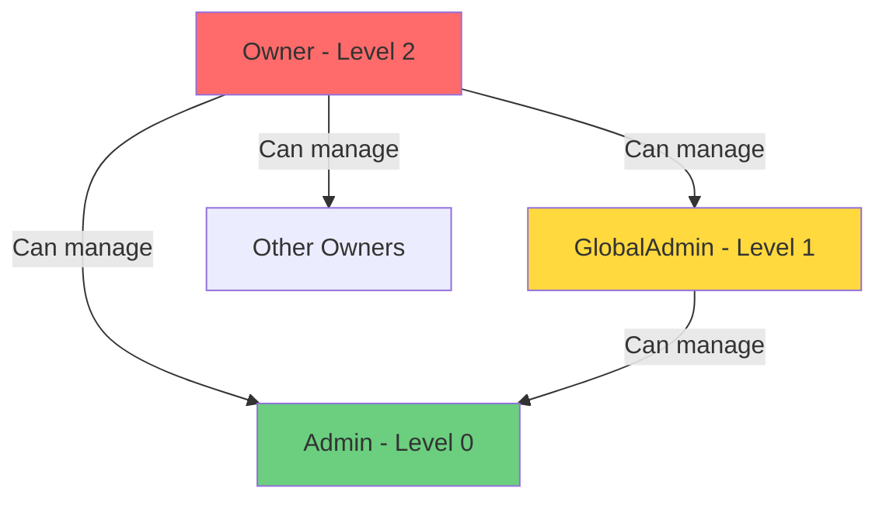

# Web User Management - Admin Accounts

Web User Management allows you to invite and manage additional administrators who can access the TelegramGroupsAdmin web interface. Control who has access and what permissions they have.

**Access**: Settings → System → Admin Accounts (Owner/GlobalAdmin only)

## Permission Levels

TelegramGroupsAdmin has a **hierarchical permission system** with three levels:

### Level 0: Admin

**Scope**: Chat-specific moderation

**Can access**:
- Messages page (only chats they're Telegram admin in)
- Reports page (only for their chats)
- Tools (Content Tester)
- Profile settings
- Documentation

**Cannot access**:
- Settings pages
- Analytics
- Users management
- Audit logs
- Admin account management

**Best for**: Chat moderators who need message browsing and spam review access

[Screenshot: Admin permission level indicator]

---

### Level 1: GlobalAdmin

**Scope**: Global moderation across ALL chats

**Can access everything Admins can, PLUS**:
- Messages from ALL chats (not just theirs)
- Reports from all chats
- Analytics page
- Users management
- Audit logs (read-only)

**Cannot access**:
- Settings → System (General, Security, Admin Accounts, External Services, Backup)
- Settings → Telegram (Bot Configuration)
- Cannot invite new admins
- Cannot change other users' permissions

**Best for**: Trusted moderators who manage moderation across all groups

---

### Level 2: Owner

**Scope**: Full system access

**Can access EVERYTHING**:
- All pages and features
- All settings and configuration
- Admin account management
- Can invite new admins
- Can change anyone's permissions (except other Owners)
- Can delete admin accounts
- Backup and restore

**Best for**: System administrators, group founders

---

## Permission Hierarchy Rules

### Escalation Protection

**You cannot grant permissions higher than your own**:
- Owner can create: Admin, GlobalAdmin, Owner
- GlobalAdmin can create: Admin only (if feature enabled)
- Admin cannot invite anyone

**You cannot modify users at your level or higher**:
- Owner can modify: Admin, GlobalAdmin, other Owners
- GlobalAdmin can modify: Admin only
- Admin cannot modify anyone

**Purpose**: Prevents privilege escalation attacks

[Screenshot: Permission hierarchy diagram]

---

## User Status

Every admin account has a status:

### Pending

**Definition**: Registered but email not verified

**Can do**: Nothing (cannot log in)

**Next step**: Must click email verification link

**Exception**: First user (Owner) auto-approved without email verification

### Active

**Definition**: Email verified, account enabled

**Can do**: Log in and use features based on permission level

**Normal state** for working accounts

### Disabled

**Definition**: Account temporarily disabled by Owner

**Can do**: Cannot log in

**Purpose**: Temporary suspension without deleting account

### Deleted

**Definition**: Account permanently deleted

**Can do**: Nothing (account gone)

**Cannot be undone**: User must register again if needed

---

## Inviting New Admins

### How to Invite

1. Navigate to **Settings** → **System** → **Admin Accounts**
2. Click **Invite New Admin** button
3. Fill out invite form:
   - **Email address** (required)
   - **Permission level** (Admin, GlobalAdmin, or Owner)
4. Click **Send Invite**

**What happens**:
- System generates 7-day invite code
- Email sent to invitee with registration link
- Link format: `https://your-domain/register?inviteCode=ABC123`
- Invitee registers using link
- New user automatically gets specified permission level

[Screenshot: Invite Admin form]

### Invite Expiration

**Invites expire after 7 days**:
- After 7 days, invite code is invalid
- Invitee cannot register with expired code
- Generate new invite if needed

**Tracking**:
- Pending invites shown in Admin Accounts table
- Status: "Invite Sent" or "Invite Expired"

### First User Special Case

**The first person to register** automatically becomes Owner:
- No invite code needed
- Email verification optional for first user
- Full system access immediately

**After first user**:
- All subsequent registrations require invite codes
- Email verification required

---

## Managing Existing Admins

### Viewing Admin Accounts

Navigate to **Settings** → **System** → **Admin Accounts**:

**Table columns**:
- **Email** - User's email address
- **Permission Level** - Admin, GlobalAdmin, Owner
- **Status** - Pending, Active, Disabled, Deleted
- **Last Login** - When they last accessed the system
- **Actions** - Edit, Disable, Delete buttons

[Screenshot: Admin Accounts table]

### Editing Permissions

**To change a user's permission level**:

1. Find user in Admin Accounts table
2. Click **Edit** button
3. Select new permission level from dropdown
4. Click **Save Changes**

**Restrictions**:
- Cannot change your own permission level
- Cannot change users at your level or higher (unless you're Owner)
- Cannot demote the last remaining Owner

### Disabling Accounts

**To temporarily disable a user**:

1. Find user in table
2. Click **Disable** button
3. Confirm action

**Effect**:
- User immediately logged out
- Cannot log in until re-enabled
- Account data preserved
- Can re-enable anytime

**Use case**: Suspicious activity, temporary suspension, vacation

### Deleting Accounts

**To permanently delete a user**:

1. Find user in table
2. Click **Delete** button
3. Confirm action (requires typing email address)

**Effect**:
- User immediately logged out
- Account permanently deleted
- Cannot be undone
- Audit log entries preserved (marked as deleted user)

**Warning**: Use sparingly, prefer Disable for temporary issues

---

## Security Best Practices

### Principle of Least Privilege

**Give users only the permissions they need**:
- Chat-specific moderators → Admin level
- Cross-group moderators → GlobalAdmin level
- System administrators → Owner level

**Don't**:
- Give everyone GlobalAdmin "just in case"
- Create multiple Owner accounts unless necessary
- Leave unused accounts Active

### Regular Access Reviews

**Quarterly review**:
1. Navigate to Admin Accounts page
2. Review last login dates
3. Disable accounts not used in 90+ days
4. Verify permission levels still appropriate

### Account Security

**Recommendations**:
- Encourage users to use strong passwords (12+ characters, password manager)
- All users must set up 2FA (enforced system-wide)

### Monitor Audit Logs

**Regularly check**:
- Settings → Audit Log
- Filter by actor to see what each admin did
- Look for suspicious activity:
  - Bulk deletions
  - Permission changes
  - Configuration changes outside working hours

---

## Common Scenarios

### Scenario 1: Adding a New Chat Moderator

**Goal**: Give someone access to moderate one specific chat

**Steps**:
1. Ensure person is Telegram admin in that chat
2. Invite with **Admin** permission level
3. They register and verify email
4. They can now access Messages/Reports for that chat only

**Result**: Least privilege, scoped to one chat

---

### Scenario 2: Promoting a Trusted Moderator

**Goal**: Moderator now manages all groups

**Steps**:
1. Find user in Admin Accounts
2. Click **Edit**
3. Change permission from Admin → GlobalAdmin
4. Save

**Result**: User can now see all chats, full moderation access

---

### Scenario 3: Removing Access After Team Member Leaves

**Goal**: Former team member should no longer have access

**Steps**:
1. Find user in Admin Accounts
2. Click **Disable** (preserves audit trail)
3. Or Click **Delete** (if you don't need history)

**Best practice**: Disable first, delete later after confirming no issues

---

### Scenario 4: Onboarding Multiple Admins

**Goal**: Invite 5 new moderators

**Steps**:
1. Create spreadsheet with emails and permission levels
2. Send invites one by one
3. Share registration instructions with team
4. Monitor Admin Accounts for registrations
5. Follow up on expired invites after 7 days

**Tip**: Send invites in batches, don't send all at once

---

## Troubleshooting

### User can't access Settings

**Symptom**: User says "Settings" link is missing

**Solution**:
- Check their permission level (must be GlobalAdmin or Owner)
- Admin-level users cannot access Settings
- Promote to GlobalAdmin if they need Settings access

### Invite code not working

**Symptom**: Invitee says registration link is invalid

**Solution**:
- Check if invite expired (7 days)
- Generate new invite
- Verify email address correct (typos)
- Check browser cache (clear cookies)

### User can't see all chats

**Symptom**: User is GlobalAdmin but only sees some chats

**Solution**:
- This is incorrect behavior, should see all chats
- Check chat_admins table in database
- Verify user's permission level in database
- Log out and log back in (refresh permissions)

### Can't delete/disable last Owner

**Symptom**: Delete button grayed out for last Owner account

**Solution**:
- System prevents deleting the last Owner
- Promote another user to Owner first
- Then delete/disable original Owner
- Always maintain at least one active Owner

---

## Audit Trail

All admin account changes are logged:

**Logged actions**:
- User invited
- User registered
- Permission level changed
- User disabled
- User deleted
- User re-enabled

**View in Audit Log**:
1. Settings → Audit Log → Web Admin Log tab
2. Filter by action type: "User Management"
3. See who did what, when

**Audit log includes**:
- **Actor**: Who made the change
- **Target**: Who was affected
- **Action**: What happened
- **Timestamp**: When it occurred
- **Details**: Old vs. new permissions

[Screenshot: Audit log showing permission change]

---

## Advanced Configuration

### Self-Registration (Disabled by Default)

**Default**: Users must have invite code to register

**To enable self-registration** (not recommended):
- Requires code change (not exposed in UI for security)
- All registrations become Pending by default
- Owner must manually approve each one

**Risk**: Unauthorized access, spam registrations

### Custom Invite Duration

**Default**: 7 days

**To change**:
- Currently hardcoded
- Future feature: Configurable in Security Settings

### Email Verification Requirement

**Default**: Required for all users except first Owner

**To disable** (not recommended):
- Requires configuration change
- All registrations immediately Active
- Risk: Typos in email, unauthorized access

---

## Related Documentation

- **[Profile & Security](../user/01-profile-security.md)** - User profile settings, 2FA
- **[Audit Log](https://future-docs/audit-log.md)** - Viewing admin actions
- **[Security Settings](https://future-docs/security-settings.md)** - Password policy, rate limiting

---

**Next: Manage your Telegram chats** → Continue to **[Chat Management](02-chat-management.md)**!
