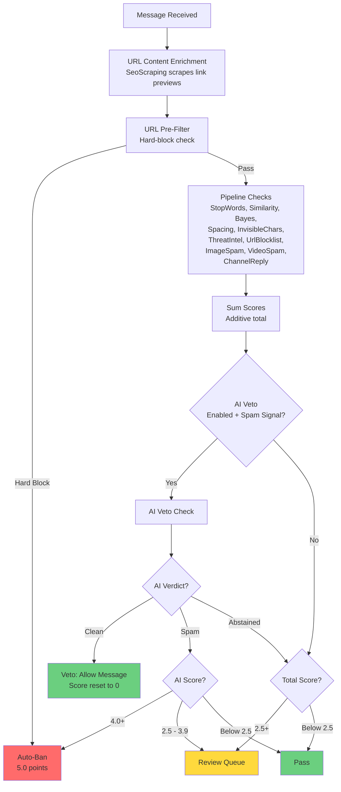
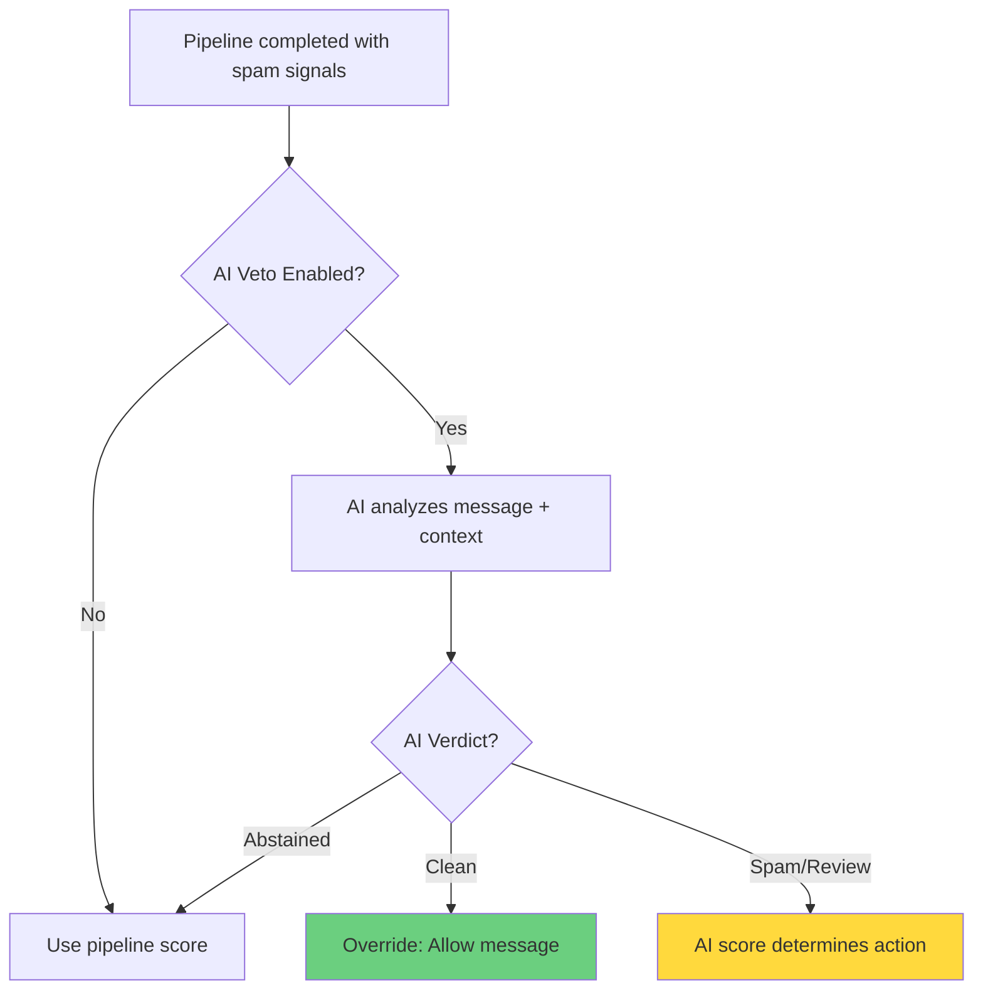
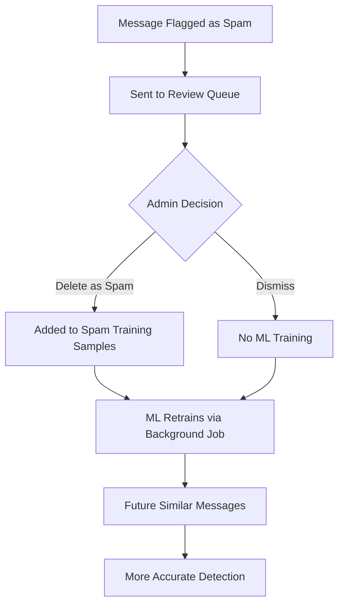

# Spam Detection - How It Works

TelegramGroupsAdmin uses a **multi-algorithm orchestration system** with **14 specialized content detection checks** that analyze different aspects of each message. Scores from individual checks are **summed additively** (not averaged) to produce a total spam score. This guide explains how the system works, what each check does, and how to optimize detection accuracy.

## Detection Architecture

### Additive Scoring Model

The V2 detection engine uses a **SpamAssassin-style additive scoring** approach:

- Each check returns **0.0 to 5.0 points** based on how strongly it detected a spam signal
- Scores from all checks are **summed together** to produce a total score
- Checks that find nothing **abstain** (score = 0.0, `Abstained = true`) instead of voting "clean"
- Default action thresholds:
  - **4.0+ points** -- Auto-Ban (requires AI confirmation when AI veto is enabled)
  - **2.5+ points** -- Review Queue (human review required)
  - **Below 2.5** -- Pass (message allowed)

This design fixes a critical bug from V1 where checks that found nothing would vote "Clean" and cancel out legitimate spam signals from other checks.

### The 14 Checks

The system defines 14 check types (`CheckName` enum), organized by their execution context:

| # | Check | Category | Score Range | Execution Context |
|---|-------|----------|-------------|-------------------|
| 1 | StopWords | Text | 0.5 - 2.0 | Pipeline |
| 2 | CAS | User | N/A | Join flow (WelcomeService) |
| 3 | Similarity | ML | 1.0 - 5.0 | Pipeline |
| 4 | Bayes | ML | 0.5 - 5.0 | Pipeline |
| 5 | Spacing | Heuristic | 0.8 | Pipeline |
| 6 | InvisibleChars | Heuristic | 1.5 | Pipeline |
| 7 | OpenAI | AI | 0.0 - 5.0 | Veto (after pipeline) |
| 8 | ThreatIntel | URL | 3.0 | Pipeline |
| 9 | UrlBlocklist | URL | 2.0 (soft) / 5.0 (hard) | Pipeline + Pre-filter |
| 10 | SeoScraping | Enrichment | N/A | Pre-processing (URL enrichment) |
| 11 | ImageSpam | Media | 0.0 - 5.0 | Pipeline |
| 12 | VideoSpam | Media | 0.0 - 5.0 | Pipeline |
| 13 | FileScanning | File | 5.0 | Separate job (FileScanJob) |
| 14 | ChannelReply | Contextual | 0.8 | Pipeline |

**Pipeline checks** run during message processing and contribute scores that are summed. **CAS** runs at join time (not on messages). **SeoScraping** enriches message text with URL preview metadata before detection. **FileScanning** runs asynchronously via a background job. **OpenAI** runs as a veto after the pipeline to confirm or override spam verdicts.

[Screenshot: Detection Algorithms configuration page]

---

## The Detection Pipeline

Here is what happens when a message arrives:



### Abstention: A Key Concept

A check **abstains** when it cannot make a determination. Abstained checks contribute 0.0 points and do not influence the total score. This prevents false negatives from diluting real spam signals. Common abstention reasons:

- **No data**: Empty message, no URLs in message, no image attached
- **Not trained**: ML model not loaded (Similarity, Bayes)
- **Below threshold**: ML probability too low to be meaningful
- **Service unavailable**: External API timeout or error (VirusTotal, AI provider)
- **User exempt**: Trusted or admin users are skipped by most checks

### Auto-Trust: Skipping Checks for Proven Users

Users who post consecutive non-spam messages are automatically whitelisted ("auto-trust"). Once trusted, most checks skip execution entirely to reduce load. Auto-trust requires:

- **N consecutive clean messages** (default: 3, configurable via `FirstMessagesCount`)
- **Minimum message length** for each counted message (default: 20 chars)
- **Minimum account age** before trust activates (default: 24 hours)

Trust is **revoked** if spam is later detected (e.g., compromised account, manual `/spam` command). Both message count and account age must be satisfied simultaneously.

---

## The 14 Detection Checks

### 1. StopWords

**What it does**: Matches message text, display name, and user ID against a customizable keyword blocklist stored in the database.

**How it works**:
- Loads enabled stop words from the database
- Strips emojis from message text before comparison
- Checks three fields: message body, username/display name, and user ID
- Case-insensitive substring matching
- Abstains when no stop words are configured or no matches are found

**Scoring tiers** (from `ScoringConstants`):

| Condition | Points |
|-----------|--------|
| 3+ matches | 2.0 (`ScoreStopWordsSevere`) |
| 2 matches | 1.0 (`ScoreStopWordsModerate`) |
| 1 match in short message (<50 chars) | 1.0 (`ScoreStopWordsModerate`) |
| 1 match in normal message (50-200 chars) | 1.0 (`ScoreStopWordsModerate`) |
| 1 match in long message (>200 chars) | 0.5 (`ScoreStopWordsMild`) |

**Configuration**: Settings --> Content Detection --> Stop Words (enable/disable). Manage keywords: Settings --> Training Data --> Stop Words Library.

**Strengths**: Extremely fast, no training required, no false positives with well-chosen keywords. **Weaknesses**: Requires manual keyword maintenance, cannot detect novel spam patterns.

**Example detection**:
```
Message: "Join my VIP crypto signals group! Guaranteed 500% profits!"
Matched: "VIP signals" (in message), "guaranteed profits" (in message)
Score: 1.0 points (2 matches = ScoreStopWordsModerate)
```

[Screenshot: Stop Words Library management]

---

### 2. CAS (Combot Anti-Spam) Database

**What it does**: Looks up user IDs in the global CAS database of known spammers maintained by Combot.

**How it works**: CAS checking runs during the **user join flow** (WelcomeService), not during message processing. When a user joins the group, their Telegram user ID is checked against the CAS API. If the user is a known spammer, the join security flow handles the response (block/restrict based on configuration).

**Configuration**: Settings --> Welcome --> Security on Join --> CAS Settings.

**Note**: CAS exists in the `CheckName` enum for historical compatibility and analytics tracking, but it does not participate in the message detection pipeline. It is a **join-time check**, not a content check.

---

### 3. Similarity (ML.NET SDCA Classifier)

**What it does**: Compares new messages to trained spam/ham samples using an ML.NET SDCA (Stochastic Dual Coordinate Ascent) text classifier that predicts spam probability.

**How it works**:
- Runs the ML.NET SDCA model prediction on the message text
- Returns a spam probability (0.0 to 1.0)
- Abstains if the model is not loaded (training required), message is too short, or probability is below the configured threshold
- Maps the ML probability to a score tier

**Scoring tiers** (from `ScoringConstants`):

| ML Probability | Points |
|---------------|--------|
| >= 95% (`SimilarityThreshold95`) | 5.0 (`ScoreSimilarity95`) |
| >= 85% (`SimilarityThreshold85`) | 3.5 (`ScoreSimilarity85`) |
| >= 70% (`SimilarityThreshold70`) | 2.0 (`ScoreSimilarity70`) |
| >= 60% (`SimilarityThreshold60`) | 1.0 (`ScoreSimilarity60`) |
| Below threshold | Abstain |

**Configuration**: Settings --> Content Detection --> Similarity. Configure probability threshold (default: 0.50). **Requires** training data -- run ML training via the background jobs page.

**Strengths**: Learns from your group's spam patterns, language-agnostic, catches spam variations. **Weaknesses**: Requires training data, slower than keyword matching, cannot detect completely novel spam types.

**Example detection**:
```
Message: "Exclusive crypto tips! Join telegram.me/scamgroup"
ML spam probability: 88.2%
Score: 3.5 points (>= 85% threshold)
```

---

### 4. Naive Bayes Classifier

**What it does**: Statistical machine learning algorithm that classifies messages based on word probability distributions learned from training data.

**How it works**:
- Uses a singleton `IBayesClassifierService` (trained via Quartz background job at startup)
- Strips emojis, then classifies the processed message text
- Calculates spam probability and certainty
- Abstains when: classifier not trained, probability below 40% (likely ham), or probability in the 40-60% uncertainty range

**Scoring tiers** (from `ScoringConstants` and `BayesConstants`):

| Spam Probability | Points |
|-----------------|--------|
| >= 99% | 5.0 (`ScoreBayes99`) |
| >= 95% | 3.5 (`ScoreBayes95`) |
| >= 80% | 2.0 (`ScoreBayes80`) |
| >= 70% | 1.0 (`ScoreBayes70`) |
| 61-69% | 0.5 (weak signal) |
| 40-60% | Abstain (uncertain) |
| Below 40% | Abstain (likely ham) |

**Configuration**: Settings --> Content Detection --> Bayes. **Requires** training data -- both spam and ham samples. Minimum message length is configurable (shared `MinMessageLength` setting).

**Strengths**: Learns from both spam and legitimate messages, fast prediction after training, handles novel patterns. **Weaknesses**: Requires balanced training data, can overfit with too few samples.

**Example detection**:
```
Message: "Click here for free money!"
Spam probability: 96%
Certainty: 0.847
Score: 3.5 points (>= 95% threshold)
```

---

### 5. Spacing Detection

**What it does**: Detects unusual character spacing patterns used by spammers to evade keyword filters, such as excessive short words or letter-by-letter spacing.

**How it works**:
- Splits the message into words by spaces
- Skips messages with too few words (configurable `MinWordsCount`)
- Calculates the ratio of "short words" (at or below `ShortWordLength` chars) to total words
- If the ratio exceeds the configurable threshold (`ShortWordRatioThreshold`), flags the message
- Returns a flat score when suspicious patterns are detected, otherwise abstains

**Scoring** (from `ScoringConstants`):

| Condition | Points |
|-----------|--------|
| Suspicious short word ratio detected | 0.8 (`ScoreFormattingAnomaly`) |
| No suspicious spacing | Abstain |

**Configuration**: Settings --> Content Detection --> Spacing. Configure short word ratio threshold, short word length, and minimum words count.

**Strengths**: Fast, catches obfuscation attempts, no training required, complements keyword detection. **Weaknesses**: Can flag artistic text formatting, less reliable than other checks as a standalone signal.

**Example detection**:
```
Message: "C L I C K   H E R E   F O R   P R O F I T S"
Short word ratio: 93% (well above threshold)
Score: 0.8 points
```

---

### 6. Invisible Character Detection

**What it does**: Detects Unicode abuse including zero-width spaces and other invisible characters that spammers use to evade text-based filters.

**How it works**:
- Scans for specific invisible/zero-width Unicode characters: U+200B (zero-width space), U+200C (zero-width non-joiner), U+200D (zero-width joiner), U+FEFF (byte order mark)
- Counts occurrences of these characters
- If any are found, returns a fixed score; otherwise abstains

**Scoring** (from `ScoringConstants`):

| Condition | Points |
|-----------|--------|
| Invisible characters found (any count) | 1.5 (`ScoreInvisibleChars`) |
| No invisible characters | Abstain |

**Configuration**: Settings --> Content Detection --> Invisible Characters (enable/disable). No threshold configuration needed.

**Strengths**: Very fast, nearly zero false positives, catches sophisticated obfuscation, no training required. **Weaknesses**: Only catches this specific technique; spammers may use other obfuscation methods.

**Example detection**:
```
Message: "He​llo! Cl​ick he​re"
         (contains zero-width spaces: U+200B)
Invisible characters found: 3
Score: 1.5 points
```

---

### 7. OpenAI / AI Veto

**What it does**: Provider-agnostic AI check that analyzes messages with human-like understanding of context, tone, and intent. Operates as a **veto** on the pipeline results rather than a regular pipeline check.

**How it works**:
- **Only runs when other pipeline checks have already flagged non-AI spam signals** (it does not run on every message)
- Combines message text, OCR-extracted text from images, and Vision analysis results into a single effective text
- Sends the combined text plus recent message history (for context) to the configured AI provider
- AI returns a JSON response with verdict (`spam`, `clean`, or `review`), a score (0.0-5.0), and reasoning
- **Clean verdict** (score = 0.0, not abstained): Vetoes the spam detection -- message is allowed regardless of pipeline score
- **Spam/Review verdict**: AI score **replaces** the pipeline total as the sole authority for action determination
- Results are cached by content hash (1-hour TTL) with stampede protection

**Scoring**:

| AI Verdict | Effect |
|-----------|--------|
| `clean` | Score = 0.0, veto triggers -- message allowed |
| `spam` with score >= 4.0 | Auto-Ban |
| `spam` with score 2.5-3.9 | Review Queue |
| `review` | Same as spam, uses AI-provided score |
| Abstained (error/timeout/no spam flags) | Defers to pipeline score |

**Veto logic flow**:



**Configuration**: Settings --> Content Detection --> AI Veto. **Requires**: AI provider configured in Settings --> System --> AI Integration. Configure custom prompt via the AI Prompt Builder. Supports `CheckShortMessages` and `MessageHistoryCount` options.

**Strengths**: Best accuracy, understands context and nuance, customizable via prompt engineering, dramatically reduces false positives. **Weaknesses**: Slowest check, most expensive (API costs), requires AI provider configuration, external dependency.

**Example detection**:
```
Pipeline detected: StopWords=1.0 + Spacing=0.8 + Similarity=2.0 = 3.8 points
AI veto runs...
AI verdict: "clean" - "This is a legitimate technical discussion about
  crypto trading. Keywords triggered false positive."
Result: VETOED - Message allowed (score reset to 0)
```

---

### 8. ThreatIntel (Threat Intelligence)

**What it does**: Validates URLs against threat intelligence services (currently VirusTotal) to detect malicious links.

**How it works**:
- Only executes when the message contains URLs (checked via regex)
- For each URL in the message, queries the VirusTotal API:
  1. Tries to fetch an existing scan report by URL hash
  2. If not found (404), submits the URL for scanning
  3. Waits 15 seconds and retries the report lookup
- If VirusTotal flags any URL as malicious (1+ engine detections), returns a positive score
- Abstains if no threats are found or API errors occur (fail-open)

**Scoring**:

| Condition | Points |
|-----------|--------|
| VirusTotal flags URL as malicious | 3.0 |
| No threats detected | Abstain |

**Configuration**: Settings --> Content Detection --> Threat Intelligence. **Requires**: VirusTotal API key configured. Note: URL scanning has ~15 second latency when a new URL must be submitted for analysis.

**Strengths**: Multi-engine malware detection (VirusTotal aggregates 70+ antivirus engines), catches phishing and scams. **Weaknesses**: Requires API key, significant latency for new URLs, rate limits apply on free API tier.

**Example detection**:
```
Message: "Great opportunity: http://phishing-site.com/login"
VirusTotal: 3 engines flagged as malicious
Score: 3.0 points
```

---

### 9. URL Blocklist

**What it does**: Validates URLs against cached domain blocklist subscriptions and manual domain filters. Supports both **hard blocks** (instant ban, pre-pipeline) and **soft blocks** (score contribution within pipeline).

**How it works**:
- **Hard block pre-filter**: Before the pipeline runs, `UrlPreFilterService` checks all URLs against hard-blocked domains. A hard block match results in an immediate auto-ban with a maximum score of 5.0 points. No further checks run.
- **Soft block in pipeline**: During the pipeline, the check extracts URLs and standalone domains from the message, normalizes them (lowercase, remove `www.` prefix), and checks each against:
  1. **Whitelist**: Whitelisted domains bypass all filters
  2. **Soft block cache**: Matches against cached blocklist subscriptions and manual filters with `BlockMode = Soft`
- Returns 2.0 points for a soft block match, otherwise abstains

**Scoring**:

| Condition | Points |
|-----------|--------|
| Hard-blocked domain (pre-filter) | 5.0 (instant ban, pipeline skipped) |
| Soft-blocked domain (pipeline) | 2.0 |
| Whitelisted domain | Abstain (skip) |
| No filter matches | Abstain |

**Configuration**: Settings --> Content Detection --> URL Filtering. Manage blocklist subscriptions (e.g., Block List Project categories: phishing, scam, malware), manual domain filters, and whitelist entries. Configure block mode (hard or soft) per filter.

**Strengths**: Huge blocklist database, nearly zero false positives, supports per-chat whitelist overrides. **Weaknesses**: New malicious domains may not be in blocklists yet, requires periodic blocklist sync.

**Example detection**:
```
Message: "Check this out: http://scam-domain.com/offer"
Domain: scam-domain.com
Soft block match: blocklist subscription ID 7
Score: 2.0 points
```

[Screenshot: URL Filtering configuration with blocklist categories]

---

### 10. SeoScraping (URL Content Enrichment)

**What it does**: Enriches message text by scraping URL preview metadata (title, description, OG tags) from linked pages. This is a **pre-processing step**, not a scoring check.

**How it works**:
- Extracts URLs from the message text
- Scrapes each URL in parallel for HTML metadata (title, meta description, og:title, og:description)
- Filters out technical metadata (viewport settings, charset declarations, CSS values)
- Appends deduplicated preview content to the message text before it enters the detection pipeline
- The enriched text gives downstream checks (StopWords, Bayes, Similarity, AI) more content to analyze

**Scoring**: N/A -- SeoScraping does not return a score. It enriches the message text so other checks can detect spam content hidden behind innocent-looking URLs.

**Configuration**: Settings --> Content Detection --> SEO Scraping (enable/disable).

**Strengths**: Exposes spam content behind link previews to text-based checks, catches promotional spam that relies on link text. **Weaknesses**: Adds latency from HTTP scraping, may fail on JavaScript-rendered pages.

**Example enrichment**:
```
Original message: "Check this out! https://scam-site.com"
After enrichment: "Check this out! https://scam-site.com

━━━ URL Previews ━━━

scam-site.com
Get Rich Quick! Guaranteed 500% Returns on Crypto!
Join our VIP signals group for guaranteed profits!"

→ StopWords now detects: "guaranteed profits", "VIP signals"
→ Bayes probability increases due to enriched text
```

---

### 11. ImageSpam (Image Content Detection)

**What it does**: Analyzes images in messages using a 3-layer detection strategy, progressing from fastest/cheapest to slowest/most comprehensive.

**How it works**:

**Layer 1 -- Perceptual Hash Similarity** (fastest):
- Computes a perceptual hash of the image
- Compares against training sample hashes (limited by `MaxTrainingSamplesToCompare`)
- If similarity exceeds threshold (`HashSimilarityThreshold`), returns the configured `HashMatchConfidence` score
- Matches against known ham samples cause an abstention (no negative scoring in V2)
- Falls through to Layer 2 if no hash match

**Layer 2 -- OCR + Text-Based Spam Detection** (medium):
- Extracts text from the image using OCR (Tesseract)
- If extracted text meets `MinOcrTextLength`, creates a text-only content check request
- Runs the full text detection pipeline (StopWords, Bayes, Similarity, etc.) on the OCR text
- If the pipeline score exceeds `OcrConfidenceThreshold`, returns that score
- Falls through to Layer 3 if uncertain

**Layer 3 -- AI Vision Fallback** (slowest, most comprehensive):
- Sends the image to the configured AI provider via Vision API
- AI analyzes the image content against common spam patterns (crypto scams, phishing, impersonation, etc.)
- AI returns a JSON response with spam verdict, score (0.0-5.0), and patterns detected
- Uses the AI-provided score directly, clamped to 0.0-5.0

OCR text is extracted early (before Layer 1) so it is available for the AI veto passthrough regardless of which layer returns the result.

**Scoring**: Depends on which layer triggers.

| Layer | Score Source |
|-------|-------------|
| Layer 1 (hash match) | Configured `HashMatchConfidence`, clamped to 0.0-5.0 |
| Layer 2 (OCR text) | Pipeline total score from text checks |
| Layer 3 (AI Vision) | AI-provided score, clamped to 0.0-5.0 |

**Configuration**: Settings --> Content Detection --> Image Spam. Configure hash similarity threshold, OCR settings, Vision API toggle. **Requires**: AI provider for Layer 3 Vision analysis.

**Strengths**: Multi-layered approach catches different types of image spam, hash matching is extremely fast for known spam, OCR catches text-heavy image spam, Vision API provides context-aware analysis. **Weaknesses**: Layer 3 is expensive (Vision API costs), minor image edits can bypass hash matching, OCR may fail on stylized text.

**Example detection**:
```
Message: [Image: Screenshot of "Join my signals group" text]
Layer 1: Best hash similarity 42% (below 85% threshold), skipping
Layer 2: OCR extracted 67 characters
  → Text pipeline: StopWords=1.0, Bayes=2.0, total=3.0
  → Score 3.0 >= OcrConfidenceThreshold, returning
Score: 3.0 points
```

---

### 12. VideoSpam (Video Content Detection)

**What it does**: Analyzes video content using a 3-layer detection strategy identical in structure to ImageSpam, applied to extracted keyframes.

**How it works**:

**Layer 1 -- Keyframe Hash Similarity** (fastest):
- Extracts keyframes from the video using FFmpeg
- Computes perceptual hashes for each frame
- Compares frame hashes against video training sample keyframes
- Returns early with configured score if a spam hash match exceeds the threshold

**Layer 2 -- OCR on Frames** (medium):
- Runs OCR on all extracted frames and collects text
- If combined text meets `MinOcrTextLength`, runs the full text detection pipeline
- Returns the pipeline score if confident enough

**Layer 3 -- AI Vision on Representative Frame** (slowest):
- Selects the best representative frame (prefers non-black frames near the video middle)
- Sends the frame to AI Vision API for analysis
- Returns the AI-provided score

All extracted frames are cleaned up (deleted) after analysis completes.

**Scoring**: Same structure as ImageSpam -- depends on which layer triggers. **Requires**: FFmpeg for frame extraction.

**Configuration**: Settings --> Content Detection --> Video Spam. Configure hash similarity, OCR, and Vision API settings independently.

**Strengths**: Catches video-based spam campaigns, reuses image detection infrastructure, keyframe approach avoids processing entire videos. **Weaknesses**: Processing time depends on video length, may miss spam in frames not extracted, expensive if Vision API runs.

**Example detection**:
```
Message: [Video: 30-second promotional video]
Keyframes extracted: 5
Layer 1: Best hash similarity 91% >= 85% threshold (SPAM match)
Score: 4.5 points (configured HashMatchConfidence)
```

---

### 13. FileScanning (Malware Detection)

**What it does**: Scans uploaded files for malware using a two-tier scanning architecture. This check runs on a **separate path** (via `FileScanJob` background job), not in the main detection pipeline.

**How it works**:

**Hash-based caching** (24-hour TTL): Before any scan, the file hash is checked against cached results. If the file has been scanned before, the cached verdict is returned immediately.

**Tier 1 -- Local Scanners** (ClamAV):
- Runs local antivirus scanners in parallel with OR voting (any positive = threat)
- If a threat is detected, returns immediately with 5.0 points (no Tier 2 needed)
- All scanner results are cached

**Tier 2 -- Cloud Services** (VirusTotal):
- Only runs if Tier 1 reports clean
- Runs cloud scanning services sequentially in priority order
- Includes both file upload scanning and hash lookup scanning
- All results are cached

**Scoring**:

| Condition | Points |
|-----------|--------|
| Malware detected (any tier) | 5.0 (definitive threat) |
| File clean (all tiers) | Abstain |
| File exceeds size limit | Abstain (fail-open) |
| Scan error | Abstain (fail-open) |

**Configuration**: Settings --> Content Detection --> File Scanning (detection flags). Infrastructure settings (ClamAV connection, VirusTotal API key) are configured separately.

**Note**: `ShouldExecute` always returns `false` for the standard pipeline -- FileScanning is invoked directly by `FileScanJob` when `MessageProcessingService` detects a file attachment. The bot downloads the file, computes its hash, and triggers the scan job asynchronously.

**Strengths**: Multi-engine detection, hash caching avoids redundant scans, fail-open design prevents blocking on infrastructure errors. **Weaknesses**: Requires external services (ClamAV, optionally VirusTotal), asynchronous -- results may arrive after the message is already visible.

**Example detection**:
```
Message: [Document: invoice.pdf.exe]
Cache: MISS
Tier 1 (ClamAV): Infected - Win.Trojan.Agent-12345
Score: 5.0 points
Action: Auto-Ban
```

---

### 14. ChannelReply (Channel Reply Signal)

**What it does**: Adds a soft spam signal when a message replies to a channel post (linked channel system post or anonymous admin posting as the group). This is a common spam pattern where bots reply to channel announcements.

**How it works**:
- Only executes when `request.Metadata.IsReplyToChannelPost` is true
- Skips trusted and admin users
- Returns a fixed score -- no complex analysis needed

**Scoring** (from `ScoringConstants`):

| Condition | Points |
|-----------|--------|
| Message is a reply to a channel post | 0.8 (`ScoreChannelReply`) |
| Not a channel reply | Does not execute |

**Configuration**: Settings --> Content Detection --> Channel Reply (enable/disable).

**Strengths**: Zero processing cost (instant), catches a common bot spam pattern. **Weaknesses**: Only useful as a confidence booster alongside other checks -- 0.8 points alone is well below any threshold.

**Example detection**:
```
Message: "Check out my trading group!" (replying to a channel announcement)
Channel reply detected
Score: 0.8 points (combined with other check scores)
```

---

## AI Veto System

The AI veto is the most important accuracy feature in the detection system. It serves as a **final check** that dramatically reduces false positives.

### How the Veto Decision Works

The engine decides whether to run the AI veto based on three conditions:

1. **Non-AI spam signals exist** -- At least one pipeline check (excluding ImageSpam and VideoSpam, which already use AI Vision) returned a positive score
2. **AI infrastructure is enabled** -- An AI provider connection is configured and active
3. **AI spam detection is enabled** -- Per-chat AI veto toggle is on

ImageSpam and VideoSpam are excluded from the veto trigger because they already use AI Vision API internally -- running a text-only AI veto on image-only messages would see blank content and produce meaningless results.

### Veto Outcomes

| Outcome | Effect |
|---------|--------|
| AI says `clean` (score=0, not abstained) | **Veto**: Message allowed, total score reset to 0 |
| AI says `spam` or `review` (with score) | **AI score replaces pipeline total** as sole authority |
| AI abstains (error, timeout, rate limit) | **Defer**: Pipeline score determines action |

When AI confirms spam, the AI-provided score is used directly to determine the action (AutoBan vs ReviewQueue), not the pipeline total. The pipeline scores served only as a gate to trigger the veto; the AI verdict drives the final action.

---

## Score Aggregation

### How Scores Combine

The detection engine uses **simple additive scoring** -- all check scores are summed:

```
Total Score = StopWords + Similarity + Bayes + Spacing + InvisibleChars
            + ThreatIntel + UrlBlocklist + ImageSpam + VideoSpam + ChannelReply
```

Abstained checks contribute 0.0 and are excluded from the sum. There are no weights -- each check's score already reflects its relative importance through the scoring tiers defined in `ScoringConstants`.

### Action Determination

Without AI veto:

```
Total Score >= 2.5  →  Review Queue (pipeline caps at ReviewQueue to guard false positives)
Total Score < 2.5   →  Allow
```

Pipeline results **never directly auto-ban** -- they cap at ReviewQueue. Auto-ban requires AI confirmation.

With AI veto (when enabled and triggered):

```
AI Score >= AutoBanThreshold (default 4.0)   →  Auto-Ban
AI Score >= ReviewQueueThreshold (default 2.5) →  Review Queue
AI Score < ReviewQueueThreshold               →  Allow
```

### Example Calculations

**Example 1: Multi-signal spam (no AI veto)**
```
Message: "Join my VIP crypto signals! bit.ly/scam123"

StopWords: 1.0 (2 matches: "VIP signals", "crypto")
Bayes: 3.5 (96% spam probability)
UrlBlocklist: 2.0 (bit.ly on soft block list)
Spacing: Abstain (no suspicious patterns)
InvisibleChars: Abstain (no invisible chars)

Total: 1.0 + 3.5 + 2.0 = 6.5 points
Action: Review Queue (pipeline caps at review)
```

**Example 2: Same message with AI veto enabled**
```
Pipeline total: 6.5 points (spam signals detected)
AI veto triggered...
AI verdict: "spam", score: 4.8, reason: "Unsolicited crypto promotion with referral link"
AI score replaces pipeline total: 4.8
Action: Auto-Ban (4.8 >= 4.0 threshold)
```

**Example 3: False positive rescued by AI veto**
```
Message: "I lost money on crypto scams, be careful with VIP signals groups"

StopWords: 1.0 (matched "crypto scams", "VIP signals")
Similarity: 2.0 (70% similar to spam training samples)
Spacing: Abstain

Pipeline total: 3.0 points → spam signals detected
AI veto triggered...
AI verdict: "clean", reason: "User is warning others about scams, not promoting one"
Result: VETOED -- message allowed, score reset to 0
```

---

## Training the ML Algorithms

Machine learning checks (Similarity, Bayes) require training data to function. Without training data, these checks abstain on every message.

### Training Workflow



### Training Requirements

**Similarity (ML.NET SDCA)**:
- Minimum: Sufficient spam + ham samples for the model to converge
- Training runs via Quartz background job
- Model predictions improve with more diverse training data

**Naive Bayes**:
- Trained via singleton service at startup and via background job
- Requires both spam and ham samples for balanced classification
- Abstains when uncertainty is high (40-60% probability range)

### Training Mode

Enable **Training Mode** in the content detection settings to force all spam detections into the review queue instead of auto-banning. This lets you validate detection accuracy before enabling auto-ban actions.

### Training Tips

- **Quality over quantity**: Mark samples consistently. Use Dismiss if unsure.
- **Balance your dataset**: Collect roughly equal spam and ham samples to prevent bias.
- **Review training data**: Settings --> Training Data --> Training Samples. Delete incorrectly labeled samples.

[Screenshot: Training Samples management page]

---

## Optimizing Detection Accuracy

### Common Issues and Solutions

**Too many false positives (legitimate messages flagged)**:

1. **Enable AI Veto** -- Single most effective change for reducing false positives
2. **Raise the review queue threshold** -- Increase from 2.5 to 3.0 or higher
3. **Whitelist common domains** -- Settings --> URL Filtering --> Whitelist
4. **Review stop words** -- Remove overly broad keywords
5. **Mark false positives as ham** -- Train ML to recognize legitimate patterns

**Spam getting through (false negatives)**:

1. **Lower the review queue threshold** -- Decrease from 2.5 to 2.0
2. **Enable more checks** -- Turn on Spacing, InvisibleChars, ChannelReply
3. **Add stop words** -- Keywords from spam that slipped through
4. **Block domains manually** -- Settings --> URL Filtering --> Manual Domains
5. **Enable stricter URL blocklists** -- Add more subscription categories

**Inconsistent detection**:

1. **Collect more training data** -- ML checks need diverse samples
2. **Enable multiple checks** -- Do not rely on just one
3. **Use consistent thresholds** -- Do not change settings frequently

---

## Related Documentation

- **[First Configuration](../getting-started/02-first-configuration.md)** -- Initial setup
- **[Reports Queue](02-reports.md)** -- Review and train
- **[URL Filtering](04-url-filtering.md)** -- Configure blocklists
- **[Content Tester](05-content-tester.md)** -- Test detection
- **[AI Prompt Builder](06-ai-prompt-builder.md)** -- Customize AI prompts
- **[Similarity Algorithm](../03-algorithms/01-similarity.md)** -- Deep dive into ML.NET SDCA
- **[Bayes Algorithm](../03-algorithms/02-bayes.md)** -- Deep dive into Naive Bayes

---

**Next: Master URL filtering** -- Continue to **[URL Filtering Guide](04-url-filtering.md)**
