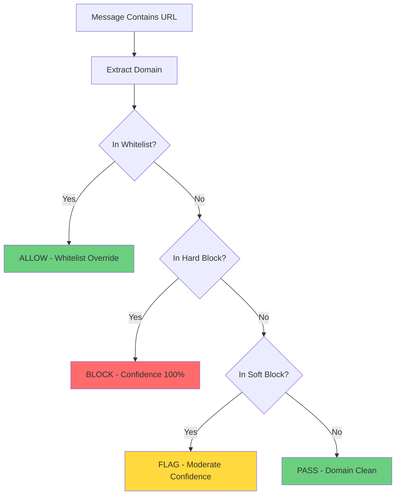

# URL Filtering - Block Malicious Links

URL Filtering protects your Telegram group from phishing links, scams, and malicious domains. With **540,000+ built-in blocklists** and support for custom domains, you can prevent nearly all link-based spam and attacks.

## Page Overview

The URL Filtering page uses a **3-column layout**:

- **Left Column**: Hard Block - Domains that are always blocked
- **Center Column**: Whitelist - Domains that are always allowed (exceptions)
- **Right Column**: Manual Domains - Custom additions for both block and whitelist

[Screenshot: URL Filtering page with 3-column layout]

---

## How URL Filtering Works

### Detection Flow



### Priority Order

1. **Whitelist** - Always checked first (highest priority)
2. **Hard Block** - Checked if not whitelisted
3. **Manual Blocks** - Custom domains you've added
4. **Pass** - If no match, URL is considered safe

**Important**: Whitelist ALWAYS wins, even if domain is on blocklists.

---

## Left Column - Hard Block

The Hard Block column contains malicious domain lists that should always be blocked.

### Built-In Blocklists

#### Block List Project Categories

TelegramGroupsAdmin includes blocklists from **The Block List Project**, curated lists of malicious domains:

**Essential** (Enable these first):
- ✅ **Phishing** - Fake login pages stealing credentials (~120,000 domains)
- ✅ **Scam** - Fraudulent websites and scams (~80,000 domains)
- ✅ **Malware** - Sites distributing malware (~95,000 domains)
- ✅ **Ransomware** - Ransomware distribution sites (~15,000 domains)

**Moderate** (Enable for stricter filtering):
- ⚠️ **Fraud** - Financial fraud and fake shops (~45,000 domains)
- ⚠️ **Abuse** - Abusive and harassment sites (~8,000 domains)
- ⚠️ **Piracy** - Copyright infringement sites (~12,000 domains)

**Aggressive** (May cause false positives):
- ❌ **Ads** - Advertising networks (~85,000 domains)
- ❌ **Tracking** - Analytics and tracking domains (~50,000 domains)
- ❌ **Redirect** - URL shorteners and redirects (~30,000 domains)

**Total**: 540,000+ domains across all categories

[Screenshot: Blocklist categories with checkboxes]

### How to Enable Blocklists

1. Navigate to **Settings** → **Content Detection** → **URL Filtering**
2. In the **Hard Block** column (left), find the category checkboxes
3. Check the categories you want to enable
4. Scroll to bottom and click **Save URL Filters**

**Recommendation**: Start with Phishing, Scam, Malware, Ransomware only.

### Manual Hard Block Domains

Below the blocklist checkboxes is a text area for **custom blocked domains**.

**How to add**:
1. Enter one domain per line
2. No `http://` or `https://` prefix (just the domain)
3. Supports wildcards (`*.example.com`)

**Example**:
```
evil-scam-site.com
phishing-domain.net
*.suspicious-network.org
```

**Use case**: Block domains specific to your group (competitor spam, known scammers)

---

## Center Column - Whitelist

The Whitelist contains domains that should **always be allowed**, even if they appear on blocklists.

### Why Whitelist?

**Common scenarios**:
- Your company/organization website
- Legitimate news sites (sometimes on ad/tracking lists)
- URL shorteners your group uses (bit.ly, tinyurl.com)
- GitHub, Wikipedia, official documentation sites

**Effect**: Whitelisted domains bypass ALL blocklists with 0% spam confidence.

### How to Whitelist Domains

1. Navigate to **Settings** → **Content Detection** → **URL Filtering**
2. In the **Whitelist** column (center), find the text area
3. Enter domains one per line
4. Supports wildcards (`*.github.com`)
5. Click **Save URL Filters**

**Example**:
```
yourcompany.com
github.com
wikipedia.org
*.stackoverflow.com
docs.microsoft.com
```

**Best practice**: Whitelist domains your group frequently shares to avoid false positives.

[Screenshot: Whitelist text area with example domains]

---

## Wildcard Patterns

Both Hard Block and Whitelist support **wildcard patterns** for flexible matching.

### Wildcard Syntax

**Asterisk (`*`)**: Matches any subdomain

**Examples**:

```
*.example.com     → Matches: sub.example.com, www.example.com, api.example.com
                    Does NOT match: example.com (no subdomain)

example.com       → Matches: example.com only
                    Does NOT match: sub.example.com

*example.com      → Matches: example.com, sub.example.com, test.example.com
                    (asterisk at start matches everything including root)
```

### Common Patterns

**Block all subdomains of a shady site**:
```
*.scam-network.com
```

**Whitelist all GitHub pages**:
```
*.github.io
*.github.com
```

**Block specific suspicious TLD**:
```
*.xyz
*.tk
*.ml
```
(Note: This is aggressive and may catch legitimate sites)

---

## Testing URL Filters

Before deploying URL filters, **always test** using the Content Tester tool.

### How to Test

1. Navigate to **Tools** → **Content Tester**
2. Enter a test message with the URL:
```
Check out this site: https://phishing-example.com/login
```
3. Click **Test Content**
4. Review results:
   - **URL/File Content** algorithm should flag it
   - Confidence should be 85%+ if on blocklist
   - Check which blocklist matched

### Test Scenarios

**Test blocked domain**:
```
Visit http://known-phishing-site.com for more info
Expected: 100% confidence, URL Content algorithm flags it
```

**Test whitelisted domain**:
```
More info at https://github.com/yourproject
Expected: 0% confidence from URL filter (whitelisted)
```

**Test wildcard block**:
```
Join our group: http://spam.evil-network.com
Expected: 100% if *.evil-network.com is blocked
```

**Test wildcard whitelist**:
```
Read docs: https://docs.microsoft.com/article
Expected: 0% if *.microsoft.com is whitelisted
```

[Screenshot: Content Tester showing URL filtering results]

---

## Advanced Configuration

### Per-Chat URL Filtering

**Future feature** (not yet implemented):
- Different URL rules per chat
- Some groups allow referrals, others don't
- Chat-specific whitelists

**Current workaround**: Global rules apply to all chats.

### URL Confidence Scoring

URL/File Content algorithm returns confidence based on:

**100% confidence**:
- Domain on Phishing, Scam, Malware, Ransomware lists
- Known high-risk domains

**75-85% confidence**:
- Domain on Fraud, Abuse lists
- Moderately suspicious

**50-70% confidence**:
- Domain on Ads, Tracking lists
- URL shorteners (if enabled)

**0% confidence**:
- Whitelisted domains
- Clean domains

### Combining with Other Algorithms

URL filtering is just one of 11 algorithms. Example combined detection:

```
Message: "Join my crypto signals group! https://bit.ly/scam123"

Detection breakdown:
  Stop Words: 85% (matched "crypto signals")
  URL Content: 100% (bit.ly → redirect list, resolves to blocked domain)
  Naive Bayes: 78% (similar to known spam)

Final confidence: 92% → AUTO-BAN
```

---

## Common Use Cases

### Use Case 1: Crypto Trading Group

**Goal**: Allow legitimate crypto sites, block pump-and-dump scams

**Configuration**:

**Hard Block**:
- ✅ Phishing
- ✅ Scam
- ✅ Fraud
- ✅ Malware

**Whitelist**:
```
coinmarketcap.com
coingecko.com
*.binance.com
*.coinbase.com
etherscan.io
bscscan.com
tradingview.com
```

**Manual Block**:
```
*.t.me (block Telegram invite links in messages)
bit.ly (block URL shorteners)
tinyurl.com
```

---

### Use Case 2: Tech Community

**Goal**: Allow documentation sites, GitHub, Stack Overflow; block spam

**Configuration**:

**Hard Block**:
- ✅ Phishing
- ✅ Scam
- ✅ Malware

**Whitelist**:
```
github.com
*.github.io
stackoverflow.com
*.stackoverflow.com
docs.microsoft.com
developer.mozilla.org
*.python.org
*.rust-lang.org
medium.com
dev.to
```

**Manual Block**:
```
(none - rely on blocklists)
```

---

### Use Case 3: Strict Moderation (No External Links)

**Goal**: Block ALL external links except approved domains

**Configuration**:

**Hard Block**:
- ✅ All categories enabled (very aggressive)

**Whitelist** (ONLY allowed domains):
```
yourcompany.com
approved-partner-1.com
approved-partner-2.com
```

**Effect**: Any domain not on whitelist is blocked.

---

## Troubleshooting

### Legitimate URLs being blocked

**Symptoms**:
- Users report "URL blocked" for safe sites
- News articles flagged as spam
- Company links rejected

**Solutions**:
1. **Check which blocklist matched**:
   - View detection breakdown
   - Identify category (Ads, Tracking, Redirect)
2. **Add to whitelist**:
   - Add specific domain to Whitelist column
   - Or use wildcard for entire subdomain
3. **Disable aggressive categories**:
   - Uncheck Ads, Tracking, Redirect blocklists
   - Keep essential categories only

### Spam URLs not being caught

**Symptoms**:
- Phishing links passing through
- Scam sites not flagged
- New malicious domains

**Solutions**:
1. **Enable more blocklist categories**:
   - Check Fraud, Abuse categories
   - Verify Phishing/Scam/Malware are enabled
2. **Add to manual block list**:
   - Copy domain from spam message
   - Add to Hard Block manual domains
3. **Use wildcard blocks**:
   - If spammer uses multiple subdomains
   - Block `*.their-network.com`
4. **Report to Block List Project**:
   - New malicious domains take time to be added
   - Report at: https://blocklist.site

### URL shorteners causing issues

**Problem**: bit.ly, tinyurl.com used for both spam and legitimate shares

**Solutions**:

**Option 1 - Block all shorteners**:
- Enable **Redirect** blocklist category
- Whitelist specific shortener if your group uses it

**Option 2 - Allow shorteners, rely on destination check**:
- Don't block shorteners themselves
- VirusTotal scans resolve shortened URLs
- Final destination gets checked against blocklists

**Option 3 - Hybrid approach**:
- Block generic shorteners (bit.ly, tinyurl)
- Whitelist branded shorteners (yourdomain.link)

### Wildcards not matching

**Symptoms**:
- `*.example.com` doesn't block `sub.example.com`

**Solutions**:
- Verify no typos in wildcard pattern
- Check if domain has additional subdomains: `sub1.sub2.example.com`
- Use more specific wildcard: `*.*.example.com`
- Or just list exact domains instead

---

## Performance Impact

### URL Filtering Speed

**Average processing time**: 10-50ms per URL

**Factors affecting speed**:
- **Number of URLs in message** - Each URL checked separately
- **Blocklist size** - More categories = slightly slower lookups
- **External API calls** - VirusTotal scanning adds latency (optional)

### Optimization Tips

**If URL filtering is slow**:

1. **Disable unused categories** - Only enable essential blocklists
2. **Limit URL checks per message** - Max 5 URLs checked per message
3. **Cache results** - Same URL within 1 hour uses cached result
4. **Disable VirusTotal for common domains** - Only scan suspicious domains

**Current performance** (540K domain database):
- Lookup: <5ms per domain
- Cache hit rate: ~70% (repeat URLs)

---

## Maintenance

### Updating Blocklists

**Built-in blocklists auto-update**:
- Frequency: Weekly (Sunday 2 AM)
- Source: The Block List Project GitHub
- Automatic: No action required

**Manual refresh**:
1. Settings → Content Detection → URL Filtering
2. Click **Refresh Blocklists** button (if available)
3. Or restart application to force update

### Reviewing Blocked URLs

**Audit blocked URLs**:
1. Navigate to Messages page
2. Filter by "Spam" status
3. Look for messages blocked by URL Content algorithm
4. Review if blocks were justified

**Analytics** (future feature):
- Most blocked domains
- Blocklist effectiveness
- False positive rate per category

### Managing Whitelist Growth

**Over time, your whitelist may grow large**:

**Best practices**:
- Review whitelist quarterly
- Remove domains no longer needed
- Use wildcards instead of listing many subdomains
- Document WHY each domain was whitelisted (comments not supported yet, use external notes)

---

## Related Documentation

- **[Spam Detection Guide](03-spam-detection.md)** - How URL filtering integrates
- **[Content Tester](05-content-tester.md)** - Test URL filters
- **[First Configuration](../getting-started/02-first-configuration.md)** - Initial URL filter setup
- **[File Scanning](https://future-docs/file-scanning.md)** - Malware detection

---

## FAQ

### Can I block specific pages, not whole domains?

**No**, URL filtering works at the domain level only.

**Example**:
- Can block: `evil-site.com` (entire domain)
- Can't block: `legitimate-site.com/bad-page` (specific page)

**Workaround**: Use Stop Words to match page URL patterns in message text.

### What about URL obfuscation (spaces, Unicode)?

**Handled automatically**:
- URLs with spaces: `h t t p s : / / evil . com` → Detected
- Unicode domains: IDN homograph attacks → Normalized
- Hex-encoded URLs: `%68%74%74%70` → Decoded

### Do shortened URLs get checked?

**Yes**, if VirusTotal is enabled:
- Shortened URL is sent to VirusTotal
- VirusTotal resolves the redirect chain
- Final destination domain is checked
- Takes longer (~500ms) but more accurate

**Without VirusTotal**:
- Only the shortener domain is checked
- If `bit.ly` is blocked, all bit.ly links are blocked
- Final destination not checked

### Can I export/import URL filters?

**Not yet implemented**, but planned:
- Export whitelist to file
- Import whitelist from file
- Share filters between installations

**Workaround**: Copy/paste from text area.

### How do I report false positives to Block List Project?

1. Visit: https://blocklist.site
2. Click "Report False Positive"
3. Provide domain and evidence it's legitimate
4. Wait for review (usually 1-7 days)

---

**Next: Test your configuration** → Continue to **[Content Tester](05-content-tester.md)**!
