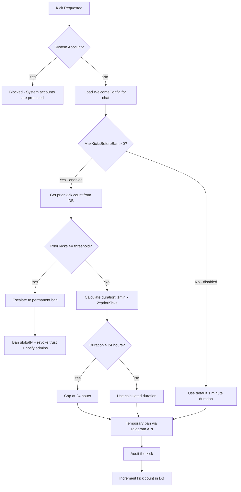

# Kick Escalation System

The **Kick Escalation System** prevents repeatedly kicked users from instantly rejoining your group. Each time a user is kicked, the rejoin cooldown doubles -- starting at 1 minute and escalating up to 24 hours. After a configurable number of kicks, the system automatically escalates to a permanent ban.

**Think of it as**: A graduated penalty system that makes each kick more impactful than the last.

## Why Kick Escalation?

Without escalation, a kicked user can rejoin the group almost immediately. This creates a frustrating cycle for admins: kick, rejoin, kick, rejoin. The escalation system solves this by:

- **Increasing cooldown periods** -- each kick doubles the time before the user can rejoin
- **Reducing admin workload** -- repeat offenders are automatically banned after a threshold
- **Using temporary bans** -- Telegram handles the cooldown natively, no manual unban needed

---

## How It Works

When a user is kicked (from any source -- welcome timeout, exam failure, admin action, or report review), the system:

1. Looks up the user's **all-time kick count** from the database
2. Checks if the count exceeds the **auto-ban threshold** (if enabled)
3. If threshold exceeded: escalates to a **permanent ban** instead of a kick
4. If below threshold: calculates an **exponential cooldown duration** based on prior kicks
5. Issues a **temporary ban** via the Telegram API with that duration
6. **Increments the kick count** for future escalation decisions

### The Formula

```
Cooldown = 1 minute x 2^(prior kick count)
```

The duration is capped at a maximum of **24 hours**. Prior kick counts above 30 are clamped to prevent integer overflow.

### Duration Table

| Prior Kicks | Cooldown Duration | Cumulative Effect |
|:-----------:|:-----------------:|:-----------------:|
| 0 | 1 minute | First offense |
| 1 | 2 minutes | Second offense |
| 2 | 4 minutes | |
| 3 | 8 minutes | |
| 4 | 16 minutes | |
| 5 | 32 minutes | |
| 6 | 64 minutes (~1 hour) | |
| 7 | 128 minutes (~2 hours) | |
| 8 | 256 minutes (~4 hours) | |
| 9 | 512 minutes (~8.5 hours) | |
| 10+ | 1,024+ minutes (capped at 24 hours) | Maximum cooldown |

---

## Kick Sources

Kicks can originate from several places in the system. Each source sets the `RevokeMessages` flag differently, which controls whether the user's recent messages are deleted on kick.

| Source | RevokeMessages | Reason |
|--------|:--------------:|--------|
| Welcome timeout | true | Cleanup join noise (user never participated) |
| Exam failure | true | Cleanup join noise (user never participated) |
| Admin command (report review) | false | Preserve legitimate message history |
| Profile scan alert (UI action) | false | Preserve legitimate message history |

All kick sources feed into the same escalation logic -- the kick count is shared across all sources and all chats.

---

## Auto-Ban Threshold

When the auto-ban threshold is enabled and a user's prior kick count meets or exceeds it, the next kick escalates to a **permanent global ban** instead.

- **Default**: `0` (disabled -- kicks never auto-escalate to bans)
- **Range**: 0-10
- **Scope**: All-time, across all managed chats

When auto-ban triggers:
- The user is banned globally (across all managed chats)
- Trust is automatically revoked (standard ban behavior)
- Admins are notified
- The ban reason includes the kick count and threshold for audit clarity

---

## Temporary Ban Mechanism

The kick system uses Telegram's built-in **temporary ban** feature rather than a ban-then-unban approach:

1. The bot calls `BanChatMemberAsync` with an `untilDate` parameter
2. Telegram removes the user from the chat immediately
3. Telegram automatically lifts the ban when `untilDate` passes
4. No scheduled unban job or manual intervention is required

This is a single API call with no database state change -- the kick is a one-time action, not a persistent ban record.

---

## Escalation Flow



---

## KickCount in the UI

The user's kick count is displayed in the **User Detail Dialog**, accessible by clicking on any user in the Users list or from report review.

The kick count appears as a stat card alongside other moderation metrics. When the count is greater than zero, it is highlighted in a warning color to draw attention.

[Screenshot: User Detail Dialog showing KickCount stat card]

---

## Configuration

### Setting the Auto-Ban Threshold

1. Navigate to **Settings** (gear icon in the sidebar)
2. Select the **Welcome** tab
3. Choose the target chat from the chat selector (or configure globally)
4. Find the **Max Kicks Before Auto-Ban** field
5. Set the desired threshold (0-10, where 0 = disabled)
6. Click **Save**

[Screenshot: Welcome settings page with Max Kicks Before Auto-Ban field]

The helper text reads: *"Auto-ban after this many kicks (all-time, across all chats, 0 = disabled)"*

### Recommended Settings

- **Small community groups (< 50 members)**: Set to `3-5` -- gives users a few chances before permanent ban
- **Large public groups (100+ members)**: Set to `2-3` -- faster escalation to reduce admin burden
- **Disabled (`0`)**: Kicks always use escalating cooldowns but never auto-ban. Useful if you prefer manual ban decisions

---

## Troubleshooting

### User rejoined immediately after kick

**Possible causes**:
- The kick count was zero (first kick = 1 minute cooldown)
- The Telegram API did not process the temporary ban correctly

**Solutions**:
- Check the user's kick count in the User Detail Dialog
- Review audit logs for the kick event
- If the issue persists, consider lowering the auto-ban threshold

### Kick escalated to ban unexpectedly

**Possible causes**:
- The user's all-time kick count exceeded the configured threshold
- The threshold was recently lowered below the user's existing kick count

**Solutions**:
- Check the user's kick count in the User Detail Dialog
- Review the ban reason -- it will show the kick count and threshold (e.g., "Auto-ban: 3 prior kicks (threshold: 3)")
- If the ban was unintended, unban the user from the User Detail Dialog

### Kick count seems too high

**Note**: Kick counts are all-time and global (across all managed chats). They are not reset on unban and do not expire. This is by design -- the count tracks the user's total kick history for escalation purposes.

---

## Related Documentation

- **[Reports Queue](02-reports.md)** -- Kick actions available during report review
- **[Spam Detection Guide](03-spam-detection.md)** -- How spam detection leads to moderation actions
- **[First Configuration](../getting-started/02-first-configuration.md)** -- Initial setup including welcome system configuration
