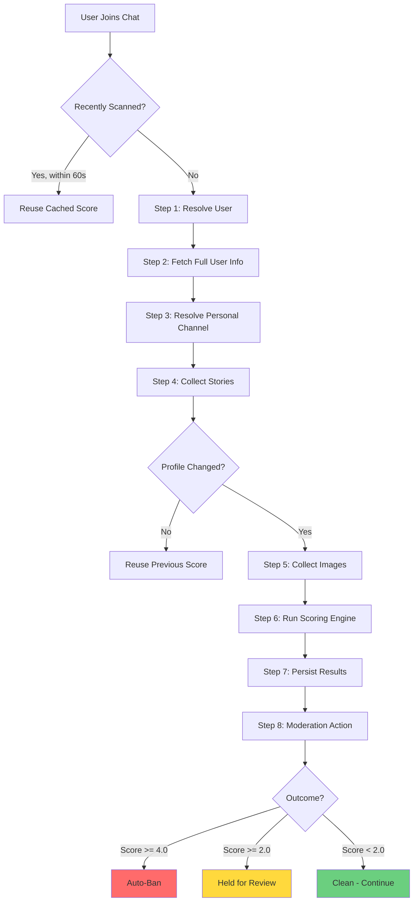
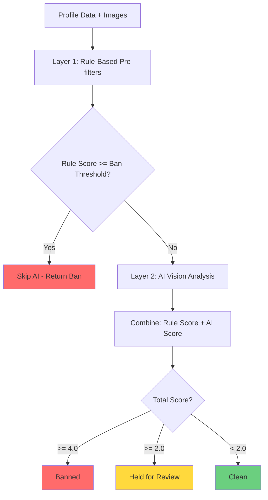

# Profile Scanning

Profile scanning inspects a user's full Telegram profile when they join a chat, using the **WTelegram User API** to access data unavailable through the standard Bot API. It collects bio text, personal channel metadata, stories, and profile images, then runs a two-layer scoring engine (rule-based checks + AI vision analysis) to automatically ban spam/adult accounts or flag suspicious profiles for admin review.

## How It Works

When a user joins a monitored chat, the profile scan pipeline runs an 8-step process that collects profile data, scores it for risk, and takes moderation action based on configurable thresholds.

### Prerequisites

- At least one **User API session** connected (Settings > User API Settings)
- **Profile Scan enabled** per chat (Settings > Welcome > Join Security > Profile Scan)
- **OpenAI API key** configured for AI vision scoring (optional but recommended)

---

## The 8-Step Scan Pipeline

### Step 1: Resolve User

Telegram requires an `access_hash` for user lookups -- bare user IDs return `USER_ID_INVALID`. The resolver tries three strategies in order:

1. **Group participant lookup** (most reliable when the triggering chat is known) -- queries `Channels_GetParticipant` using the chat's member list
2. **Username lookup** (exact global resolution) -- calls `Contacts_ResolveUsername` if the user has a username stored in the database
3. **Name search** (fuzzy global search) -- calls `Contacts_Search` with the user's full name and matches by user ID

If all strategies fail, the user is **excluded from future rescans** to avoid repeated failed lookups.

### Step 2: Fetch Full User Info

Calls `Users_GetFullUser` to retrieve the full profile, extracting:

- **Bio** (about text)
- **Personal channel ID** (linked channel)
- **Pinned stories availability** flag
- **Scam/Fake/Verified** flags (Telegram-assigned)

### Step 3: Resolve Personal Channel

If the user has a personal channel linked to their profile, the scanner fetches:

- **Channel title** (name of the personal channel)
- **Channel about** (description text from `Channels_GetFullChannel`)

The personal channel is resolved from the `fullUser.chats` collection (which includes the valid `access_hash`).

### Step 4: Collect Stories

Gathers both active and pinned stories from two sources, deduplicating by story ID:

1. **Active stories** -- already included in the `UserFull` response (no extra API call)
2. **Pinned stories** -- fetched via `Stories_GetPinnedStories` (separate API call)

For stories returned in "min" form (captions omitted), the scanner re-fetches them via `Stories_GetStoriesByID` to get full captions. Story captions are concatenated and included in the text analyzed by the scoring engine.

**Change detection checkpoint**: After Steps 1-4, the scanner compares all fetched metadata against stored values. If the profile is unchanged, Steps 5-8 are skipped and the previous score is reused. See [Change Detection](#change-detection) for details.

### Step 5: Collect Images

Downloads images for AI vision analysis, resized to a maximum of 512px on the longest dimension:

| Source | Description |
|---|---|
| Profile photo | User's main profile picture (via `DownloadProfilePhotoAsync`) |
| Personal channel photo | Channel avatar image |
| Story photos | Full photo media from stories |
| Story video thumbnails | Largest thumbnail from video stories |

Story images are capped at **4 images maximum** to control API costs and processing time. All images are resized to 512px (longest edge, preserving aspect ratio) and saved as JPEG at 85% quality.

### Step 6: Run Scoring Engine

The scoring engine runs two layers. See [Scoring Engine](#scoring-engine) for the full breakdown.

### Step 7: Persist Results

Two writes happen:

1. **User record update** -- profile metadata, score, and Telegram IDs (photo ID, channel photo ID, pinned story IDs) are saved for future change detection
2. **Scan history record** -- a `ProfileScanResultRecord` is inserted with the full scoring breakdown (rule score, AI score, reason, signals)

If the user was previously excluded from scanning (Step 1 failure), the exclusion flag is cleared on a successful scan.

### Step 8: Take Moderation Action

Based on the outcome:

| Outcome | Condition | Action |
|---|---|---|
| **Banned** | Score >= ban threshold (default 4.0) | Auto-ban via `IBotModerationService`, censor profile photo if nudity detected |
| **HeldForReview** | Score >= notify threshold (default 2.0) | Create alert report, send admin notification |
| **Clean** | Score < notify threshold | No action, user proceeds through normal welcome flow |

---

## Scoring Engine

The `ProfileScoringEngine` uses a two-layer architecture that minimizes expensive AI calls.

### Layer 1: Rule-Based Pre-filters

Fast, deterministic checks that run first:

| Check | Points | Description |
|---|---|---|
| Telegram scam/fake flag | 5.0 (instant max) | `is_scam` or `is_fake` set by Telegram |
| Blocked URL detected | +3.0 | URL in bio/channel/stories matches hard-block list |
| Stop word match | +1.5 | Text matches enabled stop words (case-insensitive) |

Text from bio, personal channel title, personal channel about, and story captions is aggregated and checked against URL blocklists and the stop words library.

If the rule-based score alone reaches the ban threshold, **Layer 2 is skipped entirely** to save API costs.

### Layer 2: AI Vision Analysis

When Layer 1 does not trigger a ban, the AI layer runs OpenAI vision analysis on all collected images plus profile text. The AI receives:

- Profile name, username, bio
- Personal channel title and description
- Story count and captions
- Image labels (e.g., "Image 1: profile photo, Image 2: story photo")
- Scraped URL metadata from any links found in profile text

The AI returns a structured JSON response with:

- **score** (0.0-5.0) -- continuous risk assessment on the application's scoring scale
- **reason** -- human-readable explanation
- **signals_detected** -- array of identified risk signals
- **contains_nudity** -- whether any image contains visible nudity (triggers blur censoring)

The AI returns the score directly on the 0.0-5.0 scale — no mapping needed. The score is clamped to the valid range via `Math.Clamp`.

**Detection categories** assessed by the AI:
1. Adult / Explicit
2. Commercial / Service Account
3. Incoherent / Manufactured
4. Bot / Mass-Created
5. Scam / Scheme Promotion
6. Impersonation

Multiple aligned signals compound (not average). The AI evaluates whether the profile belongs to a genuine community member.

### Score Scale

The total score (rule + AI) is capped at **5.0**. Default thresholds:

| Range | Outcome |
|---|---|
| 4.0 -- 5.0 | Banned |
| 2.0 -- 3.9 | Held for Review |
| 0.0 -- 1.9 | Clean |

Both thresholds are configurable per chat.

---

## What Happens When Someone Is Flagged

When a user's profile score crosses the review threshold, TGA creates a **Profile Scan Alert** and notifies you.

### Seeing the Alert

1. Navigate to **Reports** in the sidebar
2. Use the **Type** dropdown and select **Profile Scan Alerts**
3. Each alert card shows the user's profile details, score breakdown, and flagged reasons

The user remains restricted in the group until you take action — they cannot send messages or interact until you decide.

### Your Three Options

| Action | What It Does |
|--------|-------------|
| **Allow** (green) | Clears the alert, restores the user's permissions, and lets them participate normally |
| **Ban** (red) | Permanently bans the user from the group and removes their messages |
| **Kick** (orange) | Removes the user from the group without a permanent ban — they can rejoin |

### Multi-Group Behavior

If you manage multiple groups and a user triggered alerts in several of them, acting on one alert **automatically resolves the matching alerts in your other groups**. You don't need to review the same user separately in each group.

### How This Connects to the Welcome System

Profile scanning works alongside the Welcome system to gate new user admission:

1. User joins the group
2. Profile scan runs and scores their profile
3. If flagged, the user stays restricted until you review the alert
4. If the user also needs to pass a Welcome exam, both gates must clear before they get full access

This means a user won't slip through just because they passed the exam — if their profile looks suspicious, you still get the final say.

---

## Change Detection

Before running the expensive image collection and AI scoring steps (Steps 5-8), the scanner compares 15 metadata fields against stored values from the previous scan. If nothing changed, the previous score is reused.

**Fields compared:**

- Bio, personal channel ID, channel title, channel about
- Has pinned stories flag, pinned story captions
- Is scam, is fake, is verified
- First name, last name, username
- Profile photo ID, personal channel photo ID, pinned story IDs (comma-separated, sorted)

The photo and story ID comparisons detect image changes **without downloading** -- Telegram assigns unique IDs to photos and stories, so a changed ID means the content was updated.

---

## Multi-Chat Deduplication

A **60-second freshness window** prevents redundant scans when a user joins multiple chats simultaneously (e.g., a spammer joining several groups at once). If a scan completed within the last 60 seconds and produced a valid score, the cached result is reused immediately.

The dedup check reads `ProfileScannedAt` and `ProfileScanScore` from the user record. If both are present and the scan is within the window, the outcome is re-derived from the cached score using the current chat's thresholds (which may differ between chats).

---

## Photo Censoring

When a banned user's profile contains nudity (as detected by the AI `contains_nudity` flag), the stored profile photo is **censored with a Gaussian blur**:

- Blur sigma: 40 (clamped to fit the image dimensions)
- Applied using ImageSharp's `GaussianBlur` processor
- The censored image overwrites the original at `/data/media/user_photos/{userId}.jpg`

This prevents explicit images from appearing in the admin UI when reviewing banned users.

---

## Viewing Scan Results

### Profile Scan History Dialog

The `ProfileScanHistoryDialog` displays a **timeline view** of all scan results for a user, with:

- **Outcome chip** (color-coded: green for Clean, yellow for Held for Review, red for Banned)
- **Score chip** showing the total score out of 5.0
- **Score breakdown** (Rule score | AI score, with confidence percentage when available)
- **AI reason** -- the explanation from the AI vision analysis
- **AI signals** -- individual risk signals displayed as outlined chips

[Screenshot: Profile Scan History Dialog showing timeline of scan results with score breakdowns]

---

## Configuration

Profile scanning is configured in two places:

### Global: User API Sessions

**Settings > User API Settings**

Connect at least one Telegram User API session. The scanner selects the best available client -- preferring one that has access to the triggering chat for more reliable user resolution.

### Per-Chat: Join Security

**Settings > Welcome > Join Security > Profile Scan**

| Setting | Default | Description |
|---|---|---|
| Enabled | Off | Master toggle for profile scanning in this chat |
| Scan on Join | On | Trigger scan when a user joins the chat |
| Scan on Profile Change | On | Re-scan when Bot API detects name/username changes |
| Ban Threshold | 4.0 | Score at or above which users are auto-banned |
| Notify Threshold | 2.0 | Score at or above which an alert is created for admin review |

[Screenshot: Profile Scan configuration in Welcome > Join Security settings]

---

## Rate Limiting and Flood Protection

All Telegram API calls in the scan pipeline are wrapped with `TelegramFloodWaitException` handling. If any step triggers a rate limit:

- The scan is **abandoned gracefully** (not an error)
- The user is **not excluded** from future rescans
- A warning is logged with the flood wait duration
- The user proceeds through the normal welcome flow without a scan result

This prevents a temporary rate limit from permanently excluding users who should be scanned later.

---

## Troubleshooting

**Profile scan not running:**
- Verify a User API session is connected (Settings > User API Settings)
- Check that Profile Scan is enabled for the chat (Settings > Welcome > Join Security > Profile Scan)
- Confirm `ScanOnJoin` is enabled

**Users not being resolved (excluded after scan attempt):**
- The user may have deleted their Telegram account
- The User API session may not have access to the triggering chat -- verify session membership
- All three resolution strategies (participant lookup, username, name search) failed
- Check logs for "Could not resolve" messages

**AI scoring not working (only rule-based scores):**
- Verify the AI API key is configured (Settings > System > AI Providers)
- Check that the `ProfileScan` AI feature type is enabled in AI provider configuration
- Look for "ProfileScan AI feature not configured" in logs

**Scores seem stale / not updating:**
- Change detection may be skipping re-scans because the profile appears unchanged
- Verify the profile actually changed (new photo, updated bio, etc.)
- Photo ID, channel photo ID, and story IDs are compared without downloading images

**Rate limited during scans:**
- The User API session is hitting Telegram's rate limits
- Consider reducing scan frequency or connecting additional User API sessions
- Scans that hit rate limits are skipped gracefully -- users will be scanned on their next join

---

## Related Documentation

- **[Spam Detection](03-spam-detection.md)** -- Message-level spam detection (complementary to profile scanning)
- **[Reports Queue](02-reports.md)** -- Review profile scan alerts alongside message reports
- **[URL Filtering](04-url-filtering.md)** -- URL blocklists used by the rule-based scoring layer
- **[AI Prompt Builder](06-ai-prompt-builder.md)** -- Customize AI prompts for other detection features
