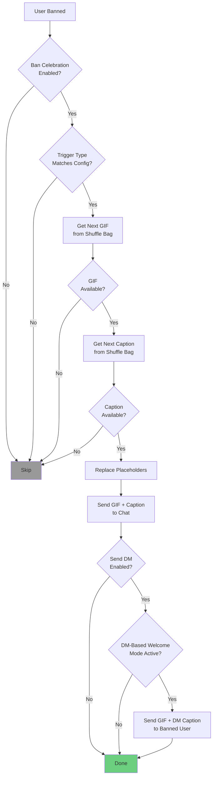

# Ban Celebration

When a spammer gets banned, why not make it memorable? The **Ban Celebration** feature posts a random celebratory GIF with a witty caption to the chat every time a user is banned. Optionally, it can also send the celebration directly to the banned user via DM for maximum impact.

GIFs and captions are drawn from a shared library and paired randomly, with a shuffle-bag algorithm ensuring every item is shown before any repeats.

## How It Works

### Celebration Flow

When a ban occurs (automatic or manual), the system checks configuration, selects a random GIF and caption, replaces placeholder variables, and sends the result to the chat.

### Shuffle-Bag Algorithm

Ban celebrations use a **shuffle-bag** (Fisher-Yates shuffle) to select GIFs and captions. This guarantees that every GIF and every caption is shown exactly once before any can repeat, preventing the same celebration from appearing twice in a row.

**How it works:**

1. All GIF IDs are loaded from the database and shuffled into a random order (the "bag")
2. Each ban draws the next GIF from the bag
3. When the bag is empty, all IDs are reloaded and reshuffled
4. Captions use a separate, independent bag with the same algorithm

**Result:** If you have 10 GIFs and 10 captions, you will see all 10 GIFs and all 10 captions before any repeats. Since GIFs and captions are paired independently, you get up to 100 unique combinations before patterns emerge.

The shuffle-bag state is held in a **singleton cache** (`BanCelebrationCache`) that persists across requests for the lifetime of the application. The cache is thread-safe and handles race conditions gracefully.

---

## Trigger Configuration

Ban celebrations can be triggered by two types of bans, each independently toggleable:

| Trigger | Description | Default |
|---------|-------------|---------|
| **Auto-ban** | Triggered when spam detection automatically bans a user (confidence >= threshold) | Enabled |
| **Manual ban** | Triggered when an admin manually bans a user via the `/ban` command or web UI | Enabled |

Both triggers can be enabled simultaneously, or you can limit celebrations to only one type.

---

## Placeholder Variables

Captions support three placeholder variables that are replaced at send time:

| Placeholder | Chat Message | DM Message | Description |
|-------------|-------------|------------|-------------|
| `{username}` | Banned user's display name | `You` | The subject of the caption |
| `{chatname}` | Chat name | Chat name | The group where the ban occurred |
| `{bancount}` | Today's count | Today's count | Total bans across all chats today (resets at midnight) |

Placeholders are case-insensitive (`{Username}`, `{USERNAME}`, and `{username}` all work).

### Chat vs. DM Grammar

Each caption has **two versions**: a chat caption and a DM caption. The DM version uses "You" grammar instead of the banned user's name, making the message more personal.

**Example caption pair:**

- **Chat:** `{username} has been eliminated! That makes {bancount} today in {chatname}.`
- **DM:** `You have been eliminated! That makes {bancount} today in {chatname}.`

---

## Configuration

### Global Settings

Navigate to **Settings > Moderation > Ban Celebration** to configure the global defaults and manage the GIF/caption library.

The global settings page has four sections:

1. **Global Configuration** -- Default toggle and trigger settings for all chats
2. **GIF Library** -- Upload, preview, and manage celebration GIFs
3. **Caption Library** -- Create, edit, and manage caption templates
4. **Test Preview** -- Preview a random GIF + caption combination

[Screenshot: Ban Celebration global settings page with all four sections visible]

### Per-Chat Settings

Individual chats can override the global defaults. Navigate to **Chat Management > (select chat) > Chat Configuration** to access per-chat ban celebration settings.

Per-chat settings include:

- **Enable/Disable** -- Master toggle for this specific chat
- **Trigger on auto-ban** -- Override the global auto-ban trigger setting
- **Trigger on manual ban** -- Override the global manual ban trigger setting
- **Send DM to banned user** -- Override the global DM setting

When a chat has no override configured, the global defaults apply.

[Screenshot: Per-chat ban celebration settings in the Chat Configuration modal]

---

## Managing GIFs

### GIF Library

The GIF library is a global collection shared across all chats. Each GIF entry includes:

- **Preview** -- Static thumbnail that animates on hover; click to view full size
- **Name** -- Optional friendly name for identification
- **Cached** -- Whether Telegram has cached the file (speeds up delivery)
- **Added** -- Date the GIF was uploaded

### Uploading a GIF

1. Click **Add GIF** in the GIF Library section
2. Choose an upload method:
   - **Upload File** -- Select a `.gif` or `.mp4` file from your computer (up to 50 MB)
   - **From URL** -- Paste a direct link to a GIF or MP4 file
3. Optionally enter a friendly name (auto-populated from filename if uploading)
4. Click **Add GIF**

The system automatically:

- Generates a thumbnail from the first frame
- Computes a perceptual hash for duplicate detection
- Checks for visually similar GIFs already in the library (87.5% similarity threshold)

If a similar GIF is detected, you can choose to **Keep Both** or **Cancel Upload**.

[Screenshot: Add GIF dialog with file upload tab selected]

### Deleting a GIF

1. Click the delete icon next to the GIF in the library table
2. Confirm the deletion in the dialog

Deleting a GIF removes both the database record and the file from disk. If the deleted GIF is still in the shuffle bag, it will be skipped automatically on next draw.

### File ID Caching

The first time a GIF is sent to Telegram, the API returns a `file_id`. This ID is cached so subsequent sends are instant (no re-upload needed). If the cached ID becomes stale, the system automatically falls back to uploading from the local file and caches the new ID.

---

## Managing Captions

### Caption Library

The caption library is a global collection shared across all chats. Each caption has:

- **Name** -- Optional friendly name (e.g., "Mortal Kombat - Fatality")
- **Chat Caption** -- Text posted to the group chat
- **DM Caption** -- Text sent directly to the banned user

### Creating a Caption

1. Click **Add Caption** in the Caption Library section
2. Enter an optional name
3. Write the **Chat Caption** using placeholder variables
4. Write the **DM Caption** (typically the same text but with "You" grammar)
5. Review the live preview panels that show how the caption will render
6. Click **Add Caption**

The preview replaces placeholders with example values (`SpammerX` for username, `Test Chat` for chatname, `42` for bancount) and renders Markdown formatting.

[Screenshot: Add Caption dialog with preview panels showing rendered Markdown]

### Editing a Caption

1. Click the edit icon next to the caption in the library table
2. Modify the text as needed
3. Review the updated preview
4. Click **Save Changes**

### Deleting a Caption

1. Click the delete icon next to the caption
2. Confirm the deletion

If the deleted caption is still in the shuffle bag, it will be skipped automatically on next draw.

### Caption Formatting

Captions support **Markdown** formatting. The chat message is sent using Telegram's Markdown parse mode, and DM messages use MarkdownV2 (escaped automatically by the system).

---

## DM Behavior

When **Send DM to banned user** is enabled, the system attempts to send the celebration GIF and DM caption directly to the banned user's private messages.

### Requirements

DM delivery requires **all** of the following:

1. The **Send DM to banned user** toggle is enabled (global or per-chat)
2. The chat uses a **DM-based welcome mode** (either DmWelcome or EntranceExam)
3. The banned user has previously interacted with the bot (started a conversation)

### DM Delivery Details

- The DM caption uses `{username}` replaced with `You` for direct address
- Media is sent as a video (for `.mp4` and `.gif` files) or photo (for other formats)
- DM failures are handled silently -- if the user has blocked the bot or never started it, the celebration still posts to the chat
- DM delivery uses the pending notification system with a 30-day expiry

---

## Test Preview

The global settings page includes a **Test Preview** section where you can preview random GIF + caption combinations without triggering an actual ban.

1. Ensure you have at least one GIF and one caption in the library
2. Click **Test Random Combo**
3. The preview shows:
   - The selected GIF (animated)
   - The chat caption with placeholders replaced using example values
   - The DM caption with "You" grammar

This is useful for verifying that your captions render correctly and that GIF + caption pairings look good together.

[Screenshot: Test Preview section showing a random GIF paired with rendered chat and DM captions]

---

## Troubleshooting

### Celebrations not posting

- **Check enabled state** -- Verify ban celebration is enabled both globally and for the specific chat
- **Check trigger type** -- If only auto-ban is enabled, manual bans will not trigger celebrations (and vice versa)
- **Verify library content** -- Both GIFs and captions are required; if either library is empty, celebrations are silently skipped
- **Check bot permissions** -- The bot needs permission to send animations in the group

### GIF not displaying / "wrong file identifier" errors

- **Stale file cache** -- The cached `file_id` may have expired. The system automatically clears stale IDs and re-uploads from the local file
- **Missing file on disk** -- If the GIF file was deleted from the `/data/media` directory, the GIF will be skipped. Re-upload it through the UI
- **File too large** -- Telegram limits file uploads to 20 MB via the Bot API

### DM not being sent to banned user

- **Welcome mode** -- DM delivery requires DM-based welcome mode (DmWelcome or EntranceExam) to be active for the chat
- **User never started bot** -- The banned user must have previously started a conversation with the bot
- **User blocked bot** -- If the user blocked the bot, DM delivery fails silently
- **DM toggle** -- Verify the "Send celebration to banned user via DM" toggle is enabled

### Duplicate GIF warning on upload

- The system uses perceptual hashing to detect visually similar GIFs (87.5% similarity threshold)
- If you receive a duplicate warning but the GIFs are genuinely different, click **Keep Both**
- If the GIF is truly a duplicate, click **Cancel Upload**

### Same GIF or caption appearing frequently

- **Small library** -- With only 2-3 GIFs, repeats will be noticeable even with the shuffle bag. Add more variety to the library
- **Application restart** -- The shuffle-bag state is in-memory. After a restart, bags are repopulated from scratch with a new random order

---

## Related Documentation

- **[Spam Detection Guide](03-spam-detection.md)** -- Understand how auto-bans are triggered
- **[Reports Queue](02-reports.md)** -- Review borderline detections before they become bans
- **[Messages](01-messages.md)** -- View ban celebration messages in the message browser
