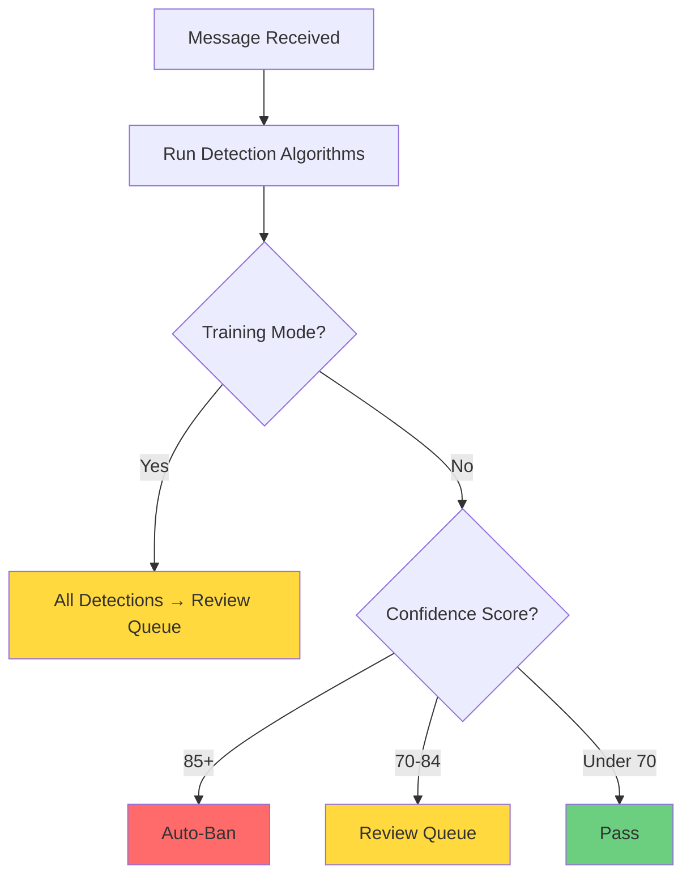
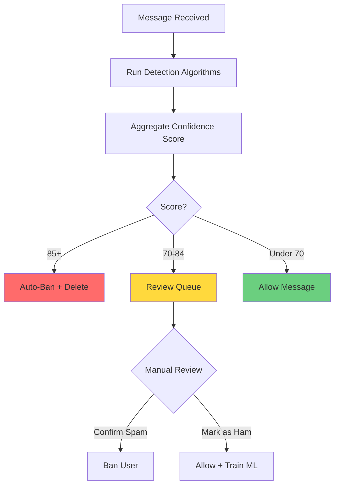

# First Configuration Guide

This guide will walk you through configuring your spam detection system for the first time. By the end, you'll have a working spam detection system that you can refine over time.

**Estimated time**: 10-15 minutes

## Configuration Philosophy: Start Conservative

When setting up spam detection for the first time, it's best to:

1. **Start with Training Mode** - Collect spam examples without risking false positives
2. **Enable basic algorithms first** - Stop Words, CAS, Invisible Characters, URL/File Scanning
3. **Use high thresholds** - Require 95+ confidence for auto-bans initially
4. **Review everything manually** - Build confidence before automating
5. **Enable ML algorithms later** - After collecting 100+ training samples

This approach minimizes the risk of accidentally banning legitimate users while you learn the system.

---

## Step 1: Enable Training Mode

**Training Mode** is a special mode where all spam detections go to a review queue instead of triggering automatic bans. This lets you see what the system would do without taking action.

### How to Enable Training Mode

1. Click **Settings** in the left sidebar
2. Click **Content Detection** → **Detection Algorithms**
3. At the top of the page, toggle **Training Mode** to **ON**
4. Scroll to the bottom and click **Save All Changes**

### What Training Mode Does

- **All detections** → Review Queue (no auto-bans)
- **Review Queue threshold ignored** - Everything goes to review
- **Auto-ban threshold ignored** - Nothing gets banned automatically
- **You make all decisions** - Confirm Spam or Mark as Ham manually

**When to disable**: After you've reviewed 50-100 detections and feel confident in the system's accuracy.

[Screenshot: Training Mode toggle in Detection Algorithms page]



---

## Step 2: Enable Basic Detection Algorithms

Start with the simplest, most reliable detection methods. These algorithms work without requiring training data or external API keys.

### Recommended Initial Algorithms

Navigate to **Settings** → **Content Detection** → **Detection Algorithms** and enable these:

#### 1. Stop Words Detection ✓

**What it does**: Matches messages against a keyword blocklist

**Why enable it**: Fast, reliable, no false positives if your stop words list is accurate

**How to configure**:
- Enable the checkbox
- Leave threshold at default (usually 75)
- You'll add stop words later in Settings → Training Data → Stop Words Library

#### 2. CAS (Combot Anti-Spam) Database ✓

**What it does**: Looks up users in a global spammer database maintained by Combot

**Why enable it**: Fast (~12ms), catches known spammers, no configuration needed

**How to configure**:
- Enable the checkbox
- No additional configuration required

#### 3. Invisible Character Detection ✓

**What it does**: Detects Unicode abuse (invisible characters, zero-width spaces, homoglyphs)

**Why enable it**: Fast, catches common spam techniques, no false positives

**How to configure**:
- Enable the checkbox
- No additional configuration required

#### 4. URL/File Content Detection ✓

**What it does**: Scans URLs against blocklists and files for malware

**Why enable it**: Catches phishing links and malware, uses 540K+ domain blocklists

**How to configure**:
- Enable the checkbox
- We'll configure URL blocklists in Step 3

### Algorithms to Enable Later

**Do NOT enable these yet** (they require training data or API keys):

- ❌ **Similarity Detection (TF-IDF)** - Needs 100+ spam samples
- ❌ **Naive Bayes Classifier** - Needs 50+ spam + 50+ ham samples
- ❌ **Spacing Detection** - Works but less reliable initially
- ❌ **Translation** - Requires OpenAI API key
- ❌ **OpenAI Verification** - Requires OpenAI API key (but very powerful once enabled)

**Remember**: Click **Save All Changes** at the bottom of the page!

[Screenshot: Detection Algorithms page with 4 algorithms enabled]

---

## Step 3: Set Conservative Thresholds

Thresholds determine what action the system takes based on the confidence score.

### Threshold Settings

Still on the **Detection Algorithms** page, configure these values:

```
Training Mode: ON (from Step 1)
Auto-Ban Threshold: 95
Review Queue Threshold: 70
First Message Only: ON
Min Message Length: 10
```

### What These Mean

**Auto-Ban Threshold (95)**:
- If confidence ≥ 95, message would normally be auto-banned
- With Training Mode ON, goes to review queue instead
- 95 is very conservative - only near-certain spam

**Review Queue Threshold (70)**:
- If confidence is 70-94, message goes to review queue
- You'll manually review these
- 70 captures borderline cases

**First Message Only (ON)**:
- Only checks the first 3 messages from new users
- Reduces false positives on established members
- Spammers usually spam immediately after joining

**Min Message Length (10)**:
- Ignores messages shorter than 10 characters
- Prevents flagging short messages like "Hi!" or "Thanks"

**Remember**: Click **Save All Changes**!

[Screenshot: Threshold configuration section]

---

## Step 4: Enable Basic URL Blocklists

URL filtering blocks messages containing links to malicious domains. Let's enable the most essential blocklists.

### Configure URL Filtering

1. Navigate to **Settings** → **Content Detection** → **URL Filtering**
2. You'll see a 3-column layout:
   - **Hard Block** (left) - Blocked domains
   - **Whitelist** (center) - Always allowed domains
   - **Manual Domains** (bottom of each column) - Custom additions

### Enable These Blocklists

In the **Hard Block** column, enable:

- ✓ **Block List Project - Phishing**
- ✓ **Block List Project - Scam**
- ✓ **Block List Project - Malware**
- ✓ **Block List Project - Ransomware**

**Why these?**: These are high-confidence blocklists with very few false positives. They block obviously malicious domains.

### Don't Enable (Yet)

❌ **Block List Project - Ads** - Too aggressive, blocks legitimate ad networks
❌ **Block List Project - Tracking** - Blocks analytics, may flag legitimate sites
❌ **Block List Project - Redirect** - Catches URL shorteners, may cause false positives

### Add Trusted Domains to Whitelist

If your group frequently shares links from specific domains, add them to the whitelist:

1. Scroll to the **Whitelist** column (center)
2. In the **Manual Domains** text area, add domains (one per line):
```
yourcompany.com
github.com
wikipedia.org
```

3. Click **Save URL Filters** at the bottom

**Tip**: Whitelisted domains will NEVER be blocked, even if they appear on blocklists.

[Screenshot: URL Filtering page showing 3-column layout with blocklists enabled]

---

## Step 5: Test Your Configuration

Before going live, let's test the system with the **Content Tester** tool.

### Using Content Tester

1. Click **Tools** in the left sidebar
2. You'll see the **Content Tester** page
3. In the text area, paste a sample spam message (example below)
4. Click **Test Content**

### Example Spam Messages to Test

**Test 1 - Stop Words**:
```
🚨 JOIN MY VIP CRYPTO SIGNALS GROUP! 💰
Guaranteed 500% profits! Click here: bit.ly/scam123
```

**Test 2 - Known Phishing Domain**:
```
Hey, check out this cool site: http://phishing-example.com/login
```

**Test 3 - Invisible Characters**:
```
He​llo! Cl​ick he​re for f​ree mo​ney
```
(Contains zero-width spaces between letters)

### Interpreting Results

The Content Tester will show:
- **Overall confidence score** (0-100)
- **Per-algorithm breakdown** - Which algorithms flagged it and why
- **Action that would be taken** - Auto-Ban, Review Queue, or Pass

**What to look for**:
- Spam messages should score 70+ (ideally 85+)
- Legitimate messages should score <70
- If something unexpected happens, adjust your configuration

[Screenshot: Content Tester showing spam detection results]

---

## Step 6: Monitor Your First Detections

Now that everything is configured, monitor your Telegram group and watch for detections.

### Where to Check

1. Navigate to **Reports** in the left sidebar
2. Click the **Moderation Reports** tab
3. You'll see spam detections appear here (because Training Mode is ON)

### Reviewing Detections

For each detection:

1. **Read the full message** - Click to expand details
2. **Check which algorithms flagged it** - Review the breakdown
3. **Make a decision**:
   - **Confirm Spam** - If it's actually spam (trains ML algorithms)
   - **Mark as Ham** - If it's a false positive (also trains ML)
   - **Dismiss** - If you're unsure (doesn't train)

**Important**: Your feedback is critical! Every "Confirm Spam" or "Mark as Ham" trains the machine learning algorithms to get smarter.

### How Many to Review

**Goal**: Review 50-100 detections before disabling Training Mode

This gives you:
- Confidence in the system's accuracy
- Training data for ML algorithms
- Understanding of what gets flagged

[Screenshot: Reports page with Moderation Reports]

---

## Step 7: After 100+ Samples - Enable ML Algorithms

Once you've reviewed 100+ messages (at least 50 spam and 50 ham), you can enable the machine learning algorithms.

### Enable These Algorithms

Navigate back to **Settings** → **Content Detection** → **Detection Algorithms**:

- ✓ **Similarity Detection (TF-IDF)** - Set threshold to 0.75
- ✓ **Naive Bayes Classifier** - Set threshold to 0.75

These algorithms learn from your training samples and get smarter over time.

**Remember**: Click **Save All Changes**!

---

## Step 8: Transition to Production Mode

When you're confident in the system (after 100+ reviews), disable Training Mode.

### Disable Training Mode

1. Navigate to **Settings** → **Content Detection** → **Detection Algorithms**
2. Toggle **Training Mode** to **OFF**
3. Lower **Auto-Ban Threshold** from 95 to **85**
4. Keep **Review Queue Threshold** at **70**
5. Click **Save All Changes**

### What Changes

- **85+ confidence** → Auto-ban (delete message + ban user)
- **70-84 confidence** → Review queue (manual review required)
- **<70 confidence** → Pass (allow message)

**Monitoring**: Continue checking the Reports page daily to review borderline cases (70-84).

[Screenshot: Training Mode toggled OFF with updated thresholds]



---

## Summary: Your Initial Configuration

Here's what you've configured:

### Enabled Algorithms
- ✓ Stop Words Detection
- ✓ CAS Database
- ✓ Invisible Character Detection
- ✓ URL/File Content Detection

### Thresholds
- Auto-Ban: 95 (Training Mode) → 85 (Production)
- Review Queue: 70
- First Message Only: ON
- Min Message Length: 10

### URL Filtering
- ✓ Phishing, Scam, Malware, Ransomware blocklists
- ✓ Whitelisted trusted domains

### Workflow
- Training Mode → Review 100+ detections → Enable ML → Transition to Production

---

## Next Steps

**Congratulations!** Your spam detection system is now configured and learning.

### Recommended Next Documentation

1. **[Messages Documentation](../features/01-messages.md)** - Learn how to browse and manage messages
2. **[Reports Documentation](../features/02-reports.md)** - Master the review queue workflow
3. **[Spam Detection Guide](../features/03-spam-detection.md)** - Deep dive into all 11 algorithms
4. **[URL Filtering Guide](../features/04-url-filtering.md)** - Advanced URL filtering techniques

### Optional Advanced Features

Once you're comfortable with the basics, consider:

- **[AI Prompt Builder](../features/06-ai-prompt-builder.md)** - Customize GPT-4 spam detection for your group's context
- **[Content Tester](../features/05-content-tester.md)** - Test detection rules before deploying
- **[ML Threshold Tuning](https://your-future-docs/ml-tuning.md)** - Let AI optimize your thresholds

---

## Tips for Success

### Daily Routine (First 30 Days)

1. **Morning**: Check Reports → Moderation Reports (review overnight detections)
2. **Afternoon**: Browse Messages page for any missed spam
3. **Evening**: Review Analytics to track trends

### Common Adjustments

**Too many false positives?**
- Increase Auto-Ban Threshold (85 → 90)
- Disable aggressive algorithms
- Add domains to whitelist

**Spam getting through?**
- Lower Auto-Ban Threshold (85 → 80)
- Enable more algorithms (Spacing Detection, Translation)
- Add stop words to blocklist

**Want better accuracy?**
- Enable OpenAI Veto (reduces false positives by 80-90%)
- See **[AI Prompt Builder](../features/06-ai-prompt-builder.md)**

---

## Troubleshooting

### No detections appearing

- Verify bot is connected (check Dashboard → Chat Health)
- Send a test spam message in your group
- Check that at least one algorithm is enabled

### Everything is being flagged

- Training Mode should prevent auto-bans
- Check your thresholds (should be 95/70 initially)
- Review your stop words list (Settings → Training Data → Stop Words Library)

### Can't save configuration

- Ensure you have Owner or GlobalAdmin permissions
- Check browser console for errors
- Try refreshing the page and saving again

### Bot banned a legitimate user

- Unban from Users page
- Mark the message as Ham in Reports
- Review your thresholds and enabled algorithms

---

## Get Help

- **[Spam Detection Guide](../features/03-spam-detection.md)** - Detailed algorithm explanations
- **[Reports Documentation](../features/02-reports.md)** - Review queue best practices
- **Audit Log** - Check Settings → Audit Log to see what actions were taken

**Ready to master the review queue?** Continue to **[Reports Documentation](../features/02-reports.md)**!
